# OpenClaw Agent 运行时原理深度剖析

> 从专业 Agent 工程师视角，全面解析 OpenClaw 的 Agent 运行时实现，
> 涵盖生命周期、上下文管理、会话隔离、Memory 机制、工具调用链路、压缩策略等核心机制。

---

## 目录

- [一、Agent 运行时总体架构](#一agent-运行时总体架构)
- [二、Pi-mono 嵌入模式深度解析](#二pi-mono-嵌入模式深度解析)
- [三、Agent 生命周期](#三agent-生命周期)
- [四、System Prompt 装配引擎](#四system-prompt-装配引擎)
- [五、Bootstrap 文件体系](#五bootstrap-文件体系)
- [六、上下文引擎 (Context Engine)](#六上下文引擎-context-engine)
- [七、会话管理与隔离](#七会话管理与隔离)
- [八、Memory 系统](#八memory-系统)
- [九、工具调用管线 (Tool Pipeline)](#九工具调用管线-tool-pipeline)
- [十、Compaction 与 Context Pruning](#十compaction-与-context-pruning)
- [十一、队列与并发控制](#十一队列与并发控制)
- [十二、Hook 系统与插件扩展](#十二hook-系统与插件扩展)
- [十三、Multi-Agent 架构](#十三multi-agent-架构)
- [十四、关键设计模式与工程经验](#十四关键设计模式与工程经验)
- [附录：源码索引](#附录源码索引)

---

## 一、Agent 运行时总体架构

### 1.1 架构定位

OpenClaw 的 Agent 运行时不是一个简单的"对话封装"，而是一个完整的 **Agent Orchestration Framework**（智能体编排框架），负责：

- **会话序列化**：保证同一会话内的 Agent 运行互斥
- **上下文装配**：将 System Prompt、Bootstrap 文件、Skills、Memory、历史消息组装为模型输入
- **工具管线**：注册、过滤、策略控制、执行包装、结果截断
- **压缩调度**：在上下文窗口溢出时自动摘要压缩
- **生命周期钩子**：在关键节点触发插件 Hook

### 1.2 核心依赖关系

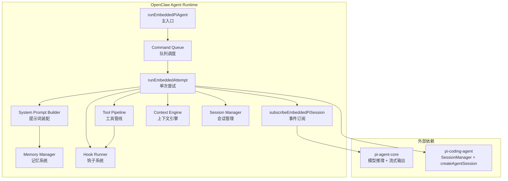

### 1.3 Pi-mono 嵌入模式（概述）

OpenClaw 采用 **嵌入式 Pi** 架构——直接在进程内调用 Pi SDK 的 JS API，而非通过子进程或 RPC。详见 [第二章](#二pi-mono-嵌入模式深度解析)。

---

## 二、Pi-mono 嵌入模式深度解析

> Pi 是一个开源的 AI Agent SDK，提供模型推理、会话管理、工具执行等基础能力。
> OpenClaw 并不直接使用 Pi CLI，而是将 Pi 的核心包作为 **嵌入式库** 集成到自己的运行时中，
> 形成了一种称为 **Pi-mono 嵌入模式** 的独特架构。

### 2.1 什么是 Pi-mono 嵌入模式

"Pi-mono" 指的是 OpenClaw 将 Pi 的多个包（`pi-agent-core`、`pi-coding-agent`、`pi-ai`）作为 **monorepo 内的嵌入依赖** 使用，而不是作为独立的外部服务：

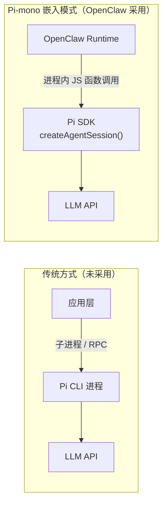

核心特征：
- **零 IPC 开销**：直接函数调用，无序列化/反序列化
- **完全控制**：OpenClaw 可以覆盖 Pi 的默认行为（System Prompt、会话存储、工具集、流式输出）
- **选择性使用**：只使用 Pi 需要的能力，替换不需要的部分

### 2.2 Pi 包矩阵与职责边界

OpenClaw 依赖 4 个 Pi 包，每个包有明确的职责：

```
package.json:
  "@mariozechner/pi-agent-core": "0.58.0"
  "@mariozechner/pi-ai":         "0.58.0"
  "@mariozechner/pi-coding-agent": "0.58.0"
  "@mariozechner/pi-tui":        "0.58.0"
```

| Pi 包 | 职责 | OpenClaw 使用的核心 API | OpenClaw 覆盖/替换的部分 |
|-------|------|------------------------|------------------------|
| **pi-agent-core** | 类型定义 + 事件模型 | `AgentMessage`, `AgentTool`, `AgentToolResult`, `AgentEvent`, `StreamFn`, `ThinkingLevel` | 无（纯类型使用） |
| **pi-ai** | LLM 通信层 | `Model`, `Api`, `streamSimple`, `complete`, `createAssistantMessageEventStream`, OAuth | 覆盖 `streamFn`（Ollama/OpenAI WS/代理） |
| **pi-coding-agent** | 会话生命周期 + 工具框架 | `createAgentSession`, `SessionManager`, `SettingsManager`, `AuthStorage`, `ModelRegistry`, `ExtensionFactory`, `ToolDefinition`, `estimateTokens` | 替换 System Prompt、会话存储路径、工具集、Settings 策略 |
| **pi-tui** | 终端 UI | 有限使用 | 大部分用 OpenClaw 自己的 CLI UI |

### 2.3 架构分层：谁做什么

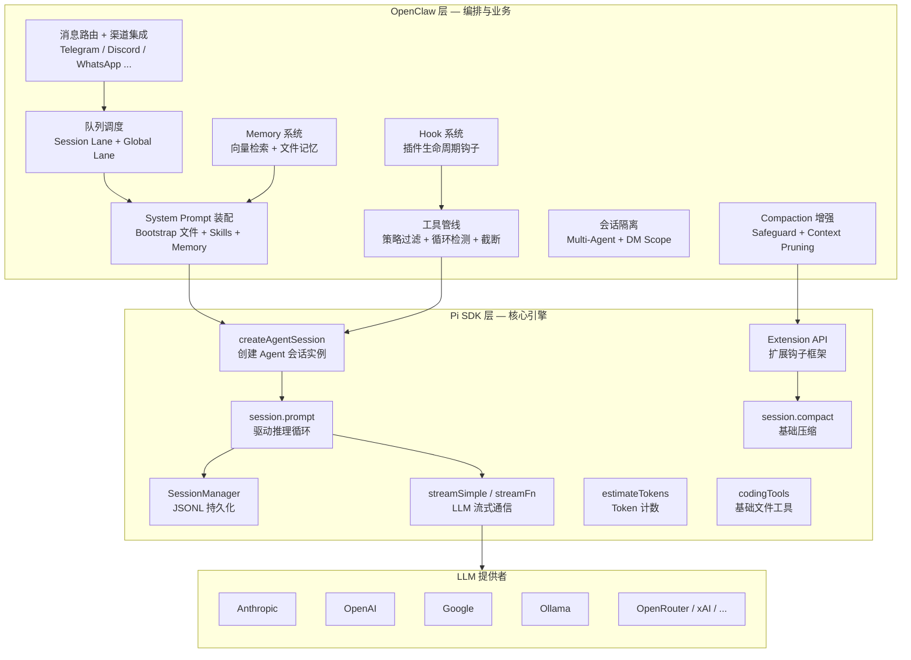

### 2.4 会话创建：`createAgentSession` 调用详解

这是 Pi-mono 嵌入的核心 API 调用，发生在 `runEmbeddedAttempt` 中：

```typescript
// src/agents/pi-embedded-runner/run/attempt.ts

import {
  createAgentSession,
  DefaultResourceLoader,
  SessionManager,
} from "@mariozechner/pi-coding-agent";

// 1. 打开会话文件（JSONL 持久化）
const sessionManager = SessionManager.open(params.sessionFile);

// 2. 守卫包装（策略检查）
guardSessionManager(sessionManager);

// 3. 准备运行（修复首次写入顺序问题）
await prepareSessionManagerForRun({
  sessionManager, sessionFile, hadSessionFile, sessionId, cwd
});

// 4. 创建 Settings Manager（控制 Pi 行为）
const settingsManager = createPreparedEmbeddedPiSettingsManager({
  cwd: resolvedWorkspace,
  agentDir,
  cfg: params.config,
});

// 5. 构建扩展工厂（Compaction Safeguard + Context Pruning）
const extensionFactories = buildEmbeddedExtensionFactories({
  cfg, sessionManager, provider, modelId, model
});

// 6. 创建资源加载器（仅扩展启用时）
let resourceLoader: DefaultResourceLoader | undefined;
if (extensionFactories.length > 0) {
  resourceLoader = new DefaultResourceLoader({
    cwd: resolvedWorkspace,
    agentDir,
    settingsManager,
    extensionFactories,
  });
  await resourceLoader.reload();
}

// 7. 工具分割 — 所有工具走 customTools，builtInTools 始终为空
const { builtInTools, customTools } = splitSdkTools({
  tools: openClawTools,   // OpenClaw 装配的完整工具集
  sandboxEnabled
});

// 8. 创建 Pi Agent 会话
const { session } = await createAgentSession({
  cwd: resolvedWorkspace,
  agentDir,
  authStorage: params.authStorage,
  modelRegistry: params.modelRegistry,
  model: params.model,
  thinkingLevel: mapThinkingLevel(params.thinkLevel),
  tools: builtInTools,         // 始终为 []
  customTools: allCustomTools, // 全部工具
  sessionManager,
  settingsManager,
  resourceLoader,
});

// 9. 覆盖 System Prompt（不使用 Pi 默认的）
applySystemPromptOverrideToSession(session, systemPromptText);

// 10. 覆盖 streamFn（Ollama / OpenAI WS 等自定义流）
if (needsCustomStream) {
  session.agent.streamFn = customStreamFn;
}

// 11. 驱动推理
await session.prompt(userMessage, { images });
```

### 2.5 关键覆盖点详解

#### 2.5.1 System Prompt 覆盖

Pi 有自己的默认 System Prompt，但 OpenClaw 完全替换它：

```typescript
// src/agents/pi-embedded-runner/system-prompt.ts
export function applySystemPromptOverrideToSession(
  session: AgentSession,
  override: string | ((defaultPrompt?: string) => string),
) {
  const prompt = typeof override === "function"
    ? override()
    : override.trim();

  // 设置新的 System Prompt
  session.agent.setSystemPrompt(prompt);

  // 覆盖内部重建函数，防止 Pi 恢复默认 Prompt
  const mutableSession = session as unknown as {
    _baseSystemPrompt?: string;
    _rebuildSystemPrompt?: (toolNames: string[]) => string;
  };
  mutableSession._baseSystemPrompt = prompt;
  mutableSession._rebuildSystemPrompt = () => prompt;
}
```

为什么要覆盖 `_rebuildSystemPrompt`？因为 Pi 在某些场景（如工具变化时）会尝试重建 System Prompt，必须拦截这个行为。

#### 2.5.2 工具集覆盖

Pi 提供基础的 `codingTools`（read/write/edit/bash），OpenClaw 做了两层处理：

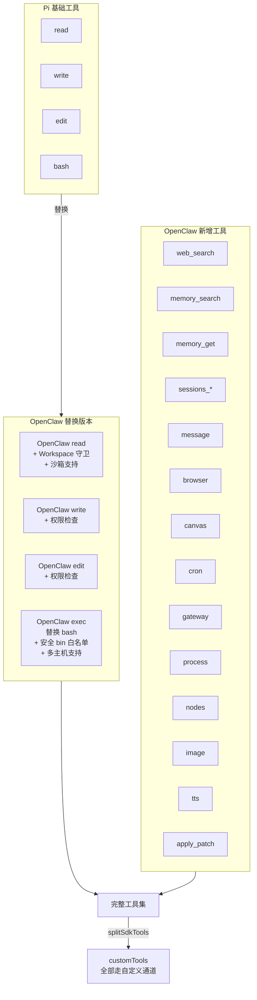

关键设计：`builtInTools` 始终为空数组，所有工具都通过 `customTools` 传入。这确保 OpenClaw 的策略过滤、沙箱集成和扩展工具集在所有提供者上行为一致。

#### 2.5.3 流式输出覆盖

Pi 默认使用 `streamSimple` 与 LLM 通信，OpenClaw 根据提供者替换 `streamFn`：

```typescript
// 针对不同提供者的 streamFn 包装器
session.agent.streamFn = wrapStreamFn(originalStreamFn, {
  // Anthropic: 缓存追踪、Thinking 处理
  // Ollama: 自定义本地推理流
  // OpenAI WebSocket: 实时 API 流
  // 代理: 转发流
});
```

覆盖场景：

| 提供者 | streamFn 处理 |
|--------|---------------|
| Anthropic | 缓存追踪、Thinking 丢弃、Turn 验证 |
| Ollama | `ollama-stream.ts` 本地推理 |
| OpenAI (WebSocket) | `openai-ws-stream.ts` 实时 API |
| Moonshot | `moonshot-stream-wrappers.ts` |
| 代理模式 | `proxy-stream-wrappers.ts` 转发 |

#### 2.5.4 会话存储覆盖

Pi 默认将会话存储在 `~/.pi/agent/sessions/`，OpenClaw 完全使用自己的路径：

```
Pi 默认路径（不使用）:
  ~/.pi/agent/sessions/<sessionId>.jsonl

OpenClaw 路径:
  ~/.openclaw/agents/<agentId>/sessions/<sessionId>.jsonl
```

通过 `SessionManager.open(params.sessionFile)` 传入 OpenClaw 的路径，Pi 的 SessionManager 就写入 OpenClaw 指定的位置。

#### 2.5.5 Settings 策略覆盖

Pi 通过 `SettingsManager` 管理项目/全局设置，OpenClaw 对此做了策略控制：

```typescript
// src/agents/pi-project-settings.ts
export function createEmbeddedPiSettingsManager(params: {
  cwd: string;
  agentDir: string;
  cfg?: OpenClawConfig;
}): SettingsManager {
  const policy = resolveEmbeddedPiProjectSettingsPolicy(params.cfg);

  if (policy === "trusted") {
    // 信任模式：直接使用 Pi 的文件设置
    return SettingsManager.create(params.cwd, params.agentDir);
  }

  // 清理模式：从文件读取，但过滤敏感设置后用内存模式
  const settings = buildEmbeddedPiSettingsSnapshot({
    globalSettings: fileSettingsManager.getGlobalSettings(),
    projectSettings: fileSettingsManager.getProjectSettings(),
    policy,   // "sanitize" 或 "ignore"
  });
  return SettingsManager.inMemory(settings);
}
```

| 策略 | 行为 |
|------|------|
| `trusted` | 完全信任 Pi 的文件设置 |
| `sanitize` | 读取 + 过滤后用内存模式 |
| `ignore` | 忽略文件设置，使用内存默认值 |

### 2.6 工具适配器：AgentTool 到 ToolDefinition

Pi SDK 内部使用 `ToolDefinition` 类型，OpenClaw 的工具使用 `AgentTool` 类型。适配器负责桥接：

```typescript
// src/agents/pi-tool-definition-adapter.ts
export function toToolDefinitions(
  tools: AnyAgentTool[]
): ToolDefinition[] {
  return tools.map((tool) => ({
    name: tool.name,
    label: tool.label ?? tool.name,
    description: tool.description ?? "",
    parameters: tool.parameters,
    execute: async (...args) => {
      const { toolCallId, params, signal, onUpdate } =
        splitToolExecuteArgs(args);

      // 1. 执行 before_tool_call Hook
      const hookOutcome = await runBeforeToolCallHook({
        toolName: tool.name,
        params,
        toolCallId,
      });
      if (hookOutcome.blocked) {
        throw new Error(hookOutcome.reason);
      }

      // 2. 执行工具（使用 Hook 可能修改后的参数）
      const rawResult = await tool.execute(
        toolCallId,
        hookOutcome.params,
        signal,
        onUpdate
      );

      // 3. 标准化结果格式
      return normalizeToolExecutionResult({
        toolName: tool.name,
        result: rawResult,
      });
    },
  }));
}
```

适配器在转换过程中注入了三个增强：
- **Hook 拦截**：`before_tool_call` 可以阻断或修改参数
- **循环检测**：检测重复工具调用模式并阻断
- **结果标准化**：统一为 `{ content: [{ type: "text", text }] }` 格式

### 2.7 扩展机制：Pi Extension API

OpenClaw 通过 Pi 的 Extension API 注入两个核心扩展：

```typescript
// src/agents/pi-embedded-runner/extensions.ts
export function buildEmbeddedExtensionFactories(params: {
  cfg: OpenClawConfig | undefined;
  sessionManager: SessionManager;
  provider: string;
  modelId: string;
  model: Model<Api> | undefined;
}): ExtensionFactory[] {
  const factories: ExtensionFactory[] = [];

  // 扩展 1: Compaction Safeguard
  if (resolveCompactionMode(cfg) === "safeguard") {
    setCompactionSafeguardRuntime(sessionManager, { ... });
    factories.push(compactionSafeguardExtension);
  }

  // 扩展 2: Context Pruning
  if (pruningEnabled && cacheEligible) {
    setContextPruningRuntime(sessionManager, { ... });
    factories.push(contextPruningExtension);
  }

  return factories;
}
```

扩展通过 Pi 的 `ExtensionAPI` 订阅事件：

```typescript
// Compaction Safeguard 扩展
api.on("session_before_compact", (event, ctx) => {
  // 自适应 Token 预算、结构化摘要、质量守卫
});

// Context Pruning 扩展
api.on("context", (event, ctx) => {
  // Cache-TTL 裁剪旧工具结果
  return { messages: pruneContextMessages(event.messages, settings) };
});
```

### 2.8 会话驱动模型

Pi Session 的核心驱动 API 是 `session.prompt()`，而不是一个持续运行的循环：

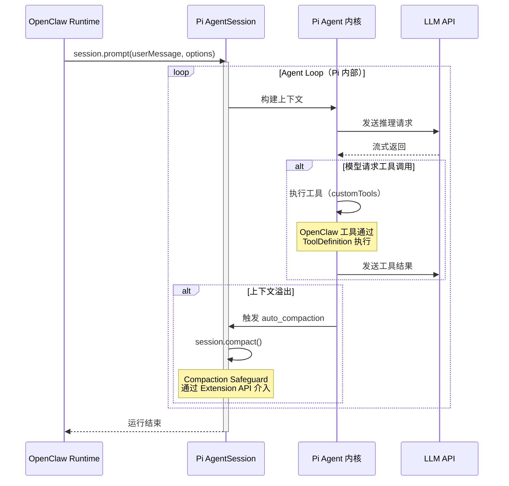

关键 `AgentSession` API：

| API | 用途 | OpenClaw 调用场景 |
|-----|------|------------------|
| `session.prompt(text, opts?)` | 驱动一轮完整的 Agent 推理循环 | 每次 Agent 运行 |
| `session.agent.setSystemPrompt(prompt)` | 设置 System Prompt | 会话创建后立即调用 |
| `session.agent.replaceMessages(messages)` | 替换消息历史 | 压缩后恢复 |
| `session.agent.streamFn` | 设置自定义 LLM 流 | Ollama/OpenAI WS |
| `session.compact(instructions?)` | 执行压缩 | 手动/自动压缩 |
| `session.abort()` | 终止运行 | 超时/用户取消 |
| `session.messages` | 读取消息列表 | 历史处理/验证 |
| `session.dispose()` | 清理资源 | 运行结束 |

### 2.9 事件订阅：subscribeEmbeddedPiSession

Pi Session 在运行时发出事件，OpenClaw 通过 `subscribeEmbeddedPiSession` 将这些事件映射到自己的流式协议：

```typescript
// Pi 事件 -> OpenClaw 流事件映射
{
  "message_start"       -> stream: "assistant" (开始)
  "message_delta"       -> stream: "assistant" (增量文本)
  "message_end"         -> stream: "assistant" (结束)
  "tool_execution_start"-> stream: "tool" (工具开始)
  "tool_execution_end"  -> stream: "tool" (工具结束)
  "turn_start"          -> stream: "lifecycle" phase: "start"
  "turn_end"            -> stream: "lifecycle" phase: "end"
  "auto_compaction_start" -> stream: "compaction"
  "auto_compaction_end"   -> stream: "compaction"
}
```

订阅器维护的状态：

```typescript
const state = {
  assistantTexts: [],       // 收集的助手文本
  toolMetas: [],            // 工具调用元数据
  toolMetaById: new Map(),  // 按 ID 索引
  deltaBuffer: "",          // 增量文本缓冲
  blockBuffer: "",          // 块输出缓冲
  compactionInFlight: false,// 压缩进行中标志
  messagingToolSentTexts: [],  // 消息工具已发送文本（去重用）
  // ... 更多状态
};
```

### 2.10 与 Pi CLI 的核心差异

| 维度 | Pi CLI | OpenClaw Pi-mono |
|------|--------|-----------------|
| **调用方式** | 独立进程 | 进程内 JS API |
| **System Prompt** | Pi 默认 Prompt | OpenClaw 自定义装配 |
| **工具集** | Pi codingTools | OpenClaw 扩展工具集（30+ 工具） |
| **会话存储** | `~/.pi/agent/sessions/` | `~/.openclaw/agents/<agentId>/sessions/` |
| **Auth 管理** | Pi 单 Profile | OpenClaw 多 Profile + 故障转移 |
| **流式输出** | 终端 TUI | 多渠道流式（WebSocket/HTTP/消息） |
| **并发控制** | 无 | 双层队列（Session + Global Lane） |
| **扩展机制** | Pi Extension API | 通过 Extension API 注入 Safeguard + Pruning |
| **记忆系统** | 无 | 文件记忆 + 向量检索 |
| **多 Agent** | 单 Agent | Multi-Agent 路由 + 隔离 |
| **消息渠道** | 终端 | Telegram/Discord/WhatsApp/Web/Signal/... |

### 2.11 源码文件索引

| 文件 | 职责 |
|------|------|
| `src/agents/pi-embedded.ts` | Pi 嵌入模块入口（re-export） |
| `src/agents/pi-embedded-runner/run.ts` | 主运行入口 `runEmbeddedPiAgent` |
| `src/agents/pi-embedded-runner/run/attempt.ts` | 单次运行尝试（含 `createAgentSession` 调用） |
| `src/agents/pi-embedded-runner/tool-split.ts` | 工具分割（全部走 customTools） |
| `src/agents/pi-embedded-runner/system-prompt.ts` | System Prompt 构建 + 覆盖 |
| `src/agents/pi-embedded-runner/extensions.ts` | Extension 工厂构建 |
| `src/agents/pi-embedded-runner/model.ts` | 模型解析（Pi ModelRegistry 集成） |
| `src/agents/pi-embedded-runner/session-manager-cache.ts` | SessionManager 缓存（TTL 45s） |
| `src/agents/pi-embedded-runner/session-manager-init.ts` | SessionManager 初始化修复 |
| `src/agents/pi-tool-definition-adapter.ts` | AgentTool -> ToolDefinition 适配器 |
| `src/agents/pi-project-settings.ts` | SettingsManager 策略控制 |
| `src/agents/pi-embedded-subscribe.ts` | Pi 事件 -> OpenClaw 流事件映射 |
| `src/agents/pi-model-discovery.ts` | Pi Auth/Model 发现 |
| `src/agents/pi-extensions/compaction-safeguard.ts` | Compaction Safeguard 扩展 |
| `src/agents/pi-extensions/context-pruning/extension.ts` | Context Pruning 扩展 |

---

## 三、Agent 生命周期

### 2.1 完整生命周期流程

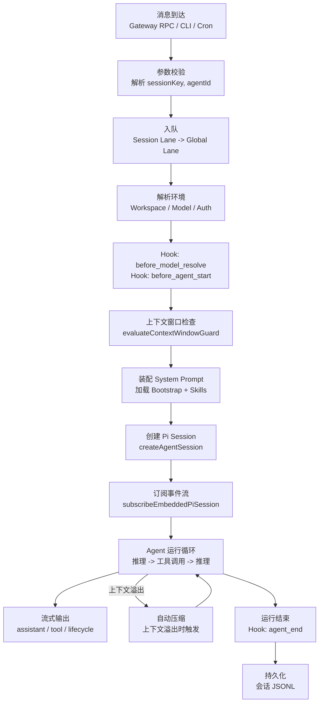

### 2.2 入口函数签名

```typescript
// 主入口 - src/agents/pi-embedded-runner/run.ts
export async function runEmbeddedPiAgent(
  params: RunEmbeddedPiAgentParams,
): Promise<EmbeddedPiRunResult>
```

### 2.3 双层队列序列化

Agent 运行通过 **双层队列** 保证并发安全：

```typescript
// 1. Session 级队列：同一会话内的请求串行
const sessionLane = resolveSessionLane(params.sessionKey);
// -> "session:agent:main:dm:+1234567890"

// 2. Global 级队列：跨会话的全局并发限制
const globalLane = resolveGlobalLane(params.lane);
// -> "main" (默认并发 4)

return enqueueSession(() =>
  enqueueGlobal(async () => {
    // 实际 Agent 运行逻辑
  })
);
```

Lane 类型：

| Lane | 用途 | 默认并发 |
|------|------|----------|
| `main` | 主消息通道 | 4 |
| `subagent` | 子 Agent | 8 |
| `cron` | 定时任务 | 映射到 `nested` 避免死锁 |
| `nested` | 嵌套调用 | 独立 |
| `session:<key>` | 会话级 | 1（串行） |

### 2.4 运行尝试与故障转移

`runEmbeddedPiAgent` 内部包含重试和故障转移逻辑：

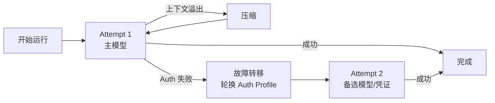

### 2.5 超时与终止

- **Agent 运行超时**：`agents.defaults.timeoutSeconds`（默认 600 秒）
- **RPC 等待超时**：`agent.wait` 默认 30 秒（可配置 `timeoutMs`）
- **终止信号**：AbortSignal、Gateway 断连、RPC 超时

---

## 四、System Prompt 装配引擎

### 4.1 装配流程

System Prompt 是 Agent 行为的核心驱动。OpenClaw 通过 `buildAgentSystemPrompt` 将多个来源的内容组装为最终 Prompt：

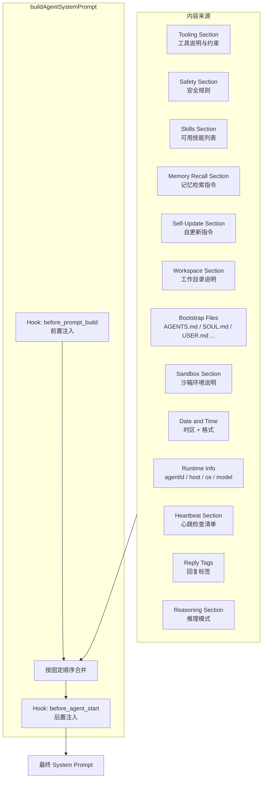

### 4.2 Prompt 模式

| 模式 | 用途 | 包含内容 |
|------|------|----------|
| `full` | 默认完整模式 | 所有 Section |
| `minimal` | 子 Agent 模式 | 省略 Skills、Memory Recall、Self-Update、Model Aliases、User Identity、Reply Tags、Messaging、Heartbeats |
| `none` | 最小身份 | 仅基本身份标识 |

### 4.3 关键函数签名

```typescript
// src/agents/system-prompt.ts
export function buildAgentSystemPrompt(params: {
  workspaceDir: string;
  toolNames?: string[];              // 可用工具名称列表
  toolSummaries?: Record<string, string>;  // 工具摘要
  contextFiles?: EmbeddedContextFile[];    // Bootstrap 文件内容
  skillsPrompt?: string;             // Skills 列表 XML
  heartbeatPrompt?: string;          // 心跳清单
  promptMode?: PromptMode;           // "full" | "minimal" | "none"
  runtimeInfo?: RuntimeInfo;         // 运行时环境信息
  sandboxInfo?: EmbeddedSandboxInfo; // 沙箱配置
  memoryCitationsMode?: MemoryCitationsMode;
  // ... 更多参数
}): string
```

### 4.4 Skills 在 Prompt 中的表示

Skills 以紧凑的 XML 列表注入 System Prompt，而非完整内容：

```xml
<available_skills>
  <skill>
    <name>mintlify</name>
    <description>Mintlify docs editing and preview</description>
    <location>~/.openclaw/skills/mintlify/SKILL.md</location>
  </skill>
  <!-- 更多 skill -->
</available_skills>
```

Agent 在需要时通过 `read` 工具加载 `SKILL.md` 的完整内容。这种 **延迟加载** 设计节省了宝贵的上下文窗口空间。

### 4.5 Memory Recall 指令

当 `memory_search` 或 `memory_get` 工具可用时，System Prompt 中注入 Memory Recall 指令：

```
## Memory Recall
Before answering anything about prior work, decisions, dates, people,
preferences, or todos: run memory_search on MEMORY.md + memory/*.md;
then use memory_get to pull only the needed lines.
If low confidence after search, say you checked.
```

---

## 五、Bootstrap 文件体系

### 5.1 文件角色定义

| 文件 | 角色 | 加载条件 |
|------|------|----------|
| `AGENTS.md` | 主指令文件：行为规则、约束、记忆提示 | 始终加载 |
| `SOUL.md` | 人格定义：语气、边界、风格 | 始终加载 |
| `TOOLS.md` | 工具使用说明与技巧 | 始终加载 |
| `IDENTITY.md` | 名称、风格、表情符号 | 始终加载 |
| `USER.md` | 用户画像与偏好 | 始终加载 |
| `HEARTBEAT.md` | 心跳检查清单 | 可选 |
| `BOOTSTRAP.md` | 首次运行初始化脚本 | 仅新 Workspace 首次 |
| `MEMORY.md` | 长期记忆 | 仅主私有会话 |

### 5.2 加载与截断机制

```typescript
// src/agents/pi-embedded-helpers/bootstrap.ts
export function buildBootstrapContextFiles(
  files: WorkspaceBootstrapFile[],
  opts?: { maxChars?: number; totalMaxChars?: number },
): EmbeddedContextFile[]
```

截断策略：
- **单文件上限**：`DEFAULT_BOOTSTRAP_MAX_CHARS = 20,000` 字符
- **总量上限**：`DEFAULT_BOOTSTRAP_TOTAL_MAX_CHARS = 150,000` 字符
- **截断方式**：保留头部 70% + 尾部 20%，中间截断并标记警告
- **空文件跳过**：内容为空的 Bootstrap 文件不注入

### 5.3 加载管线

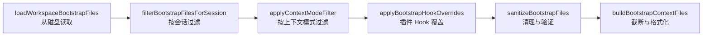

---

## 六、上下文引擎 (Context Engine)

### 6.1 可插拔架构

Context Engine 采用 **注册式插件架构**，允许替换默认实现：

```typescript
// src/context-engine/types.ts
export interface ContextEngine {
  readonly info: ContextEngineInfo;

  // 会话开始时的初始化
  bootstrap?(params: {
    sessionId: string;
    sessionKey?: string;
    sessionFile: string;
  }): Promise<BootstrapResult>;

  // 新消息进入
  ingest(params: {
    sessionId: string;
    message: AgentMessage;
    isHeartbeat?: boolean;
  }): Promise<IngestResult>;

  // 批量消息注入
  ingestBatch?(params: { ... }): Promise<IngestBatchResult>;

  // Turn 结束后的处理
  afterTurn?(params: { ... }): Promise<void>;

  // 装配上下文（发送给模型前）
  assemble(params: {
    sessionId: string;
    messages: AgentMessage[];
    tokenBudget?: number;
  }): Promise<AssembleResult>;

  // 压缩历史
  compact(params: {
    sessionId: string;
    sessionFile: string;
    tokenBudget?: number;
    force?: boolean;
    customInstructions?: string;
  }): Promise<CompactResult>;

  // 子 Agent 相关
  prepareSubagentSpawn?(params: { ... }): Promise<SubagentSpawnPreparation | undefined>;
  onSubagentEnded?(params: { ... }): Promise<void>;

  // 清理
  dispose?(): Promise<void>;
}
```

### 6.2 注册与解析

```typescript
// src/context-engine/registry.ts
export function registerContextEngine(id: string, factory: ContextEngineFactory): void;
export function resolveContextEngine(config?: OpenClawConfig): Promise<ContextEngine>;
export function listContextEngineIds(): string[];
```

### 6.3 上下文窗口守卫

```typescript
// src/agents/agent-scope.ts
export function evaluateContextWindowGuard(
  info: ContextWindowInfo
): ContextWindowGuardResult

// 硬限制：最低 16,000 tokens
const CONTEXT_WINDOW_HARD_MIN_TOKENS = 16_000;
// 警告线：低于 32,000 tokens 时警告
const CONTEXT_WINDOW_WARN_BELOW_TOKENS = 32_000;
```

### 6.4 工具结果上下文预算

```typescript
// src/agents/pi-embedded-runner/tool-result-context-guard.ts
export function installToolResultContextGuard(params: {
  agent: GuardableAgent;
  contextWindowTokens: number;
}): () => void
```

工作原理：
- 包装 `agent.transformContext`，在每次模型调用前检查上下文大小
- 自动截断超长工具结果（保留头部 + 尾部）
- 单个工具结果上限：上下文窗口的 30%

Token 估算常量：

```typescript
const CHARS_PER_TOKEN_ESTIMATE = 4;
const TOOL_RESULT_CHARS_PER_TOKEN_ESTIMATE = 2;
```

---

## 七、会话管理与隔离

### 7.1 会话键 (Session Key) 体系

会话键是会话隔离的核心标识，采用分层命名：

```
agent:<agentId>:<scope>

// 示例
agent:main:main                          // 主私有会话
agent:main:dm:+1234567890               // DM 会话（per-peer）
agent:main:telegram:dm:+1234567890      // DM 会话（per-channel-peer）
agent:main:telegram:group:123456        // Telegram 群组
agent:main:discord:channel:789012       // Discord 频道
cron:daily-report                       // 定时任务
hook:a1b2c3d4                          // Webhook
node-worker1                           // 节点会话
```

### 7.2 DM 作用域 (dmScope)

| 模式 | 行为 | 适用场景 |
|------|------|----------|
| `main` | 所有 DM 共享主会话 | 单用户场景 |
| `per-peer` | 按发送者 ID 隔离，跨渠道 | 多用户共用 Agent |
| `per-channel-peer` | 按渠道 + 发送者隔离 | 共享收件箱 |
| `per-account-channel-peer` | 按账号 + 渠道 + 发送者隔离 | 多账号多渠道 |

### 7.3 会话存储

```
~/.openclaw/
  agents/
    main/                           # agentId = "main"
      sessions/
        sessions.json               # 会话索引
        <SessionId>.jsonl           # 对话日志（JSONL 格式）
        <SessionId>-topic-<threadId>.jsonl  # Telegram topic
```

JSONL 格式：每行一个消息，包含 `id`、`parentId`、`role`、`content`、`toolUse`、`toolResult` 等字段。

### 7.4 跨渠道身份关联

```json
{
  "session": {
    "identityLinks": {
      "telegram:12345": "canonical-user-id",
      "discord:67890": "canonical-user-id"
    }
  }
}
```

不同渠道的同一用户可以共享同一个会话上下文。

### 7.5 会话重置策略

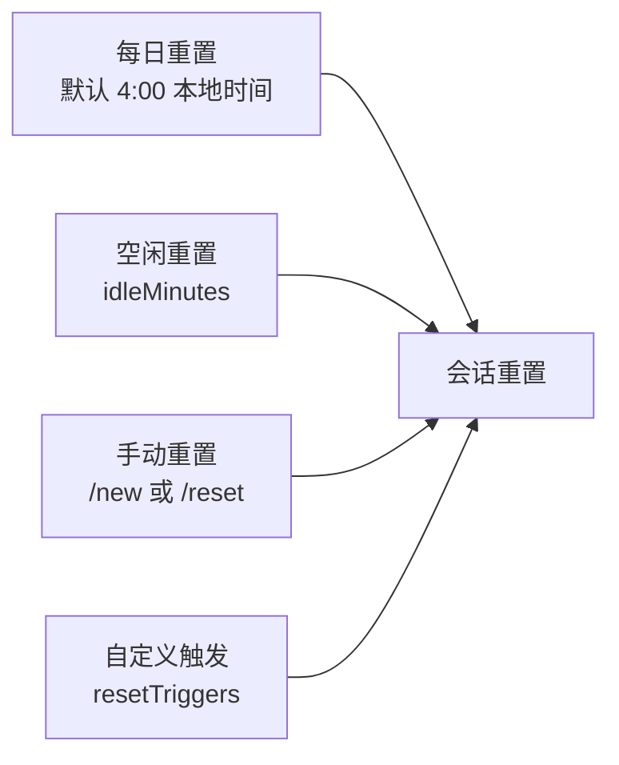

支持 `resetByType` / `resetByChannel` 针对不同类型或渠道配置不同的重置策略。

---

## 八、Memory 系统

### 8.1 双层记忆架构

OpenClaw 的记忆系统分为 **文件记忆** 和 **向量检索** 两层：

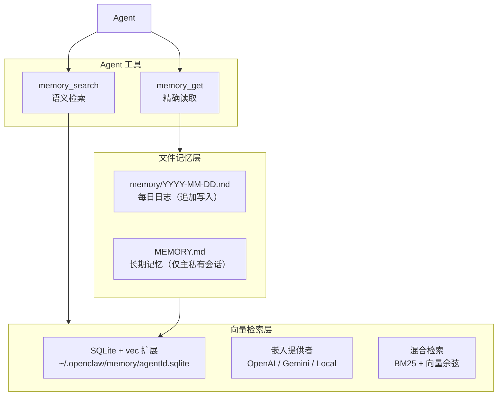

### 8.2 Memory Search 工具

```typescript
// src/agents/tools/memory-tool.ts
export function createMemorySearchTool(options: {
  config?: OpenClawConfig;
  agentSessionKey?: string;
}): AnyAgentTool | null

// Schema
const MemorySearchSchema = Type.Object({
  query: Type.String(),           // 搜索查询
  maxResults: Type.Optional(Type.Number()),  // 最大结果数
  minScore: Type.Optional(Type.Number()),    // 最低分数阈值
});
```

### 8.3 混合检索算法

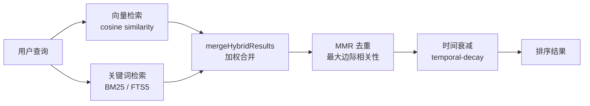

核心实现：

```typescript
// src/memory/manager-search.ts
// 向量检索 - 余弦距离
"SELECT ... vec_distance_cosine(v.embedding, ?) AS dist ..."

// 关键词检索 - BM25
"SELECT ... bm25(fts_table) AS rank ..."
```

### 8.4 Memory Flush（压缩前记忆刷写）

当上下文接近溢出时，Agent 会在压缩前执行 Memory Flush：

```
触发条件：tokens > contextWindow - reserveTokensFloor - softThresholdTokens
行为：Agent 将重要信息写入 memory/ 文件
特点：静默执行（Prompt 包含 NO_REPLY 标签）
限制：workspaceAccess 为 "ro" 或 "none" 时跳过
```

### 8.5 嵌入提供者

| 提供者 | 类型 | 特点 |
|--------|------|------|
| OpenAI | 远程 API | 默认首选 |
| Gemini | 远程 API | 备选 |
| Voyage | 远程 API | 高质量嵌入 |
| Mistral | 远程 API | 多语言 |
| Ollama | 本地推理 | 离线可用 |
| Local (node-llama-cpp) | 本地文件 | 零延迟 |

选择优先级：`本地模型 > OpenAI > Gemini`

### 8.6 Session Memory（实验性）

```json
{
  "memorySearch": {
    "experimental": {
      "sessionMemory": true
    }
  }
}
```

启用后，向量索引包含会话转录内容，允许跨会话语义检索。

---

## 九、工具调用管线 (Tool Pipeline)

### 9.1 管线总览

这是 OpenClaw Agent 最精密的子系统之一，工具从注册到执行经过多层处理：

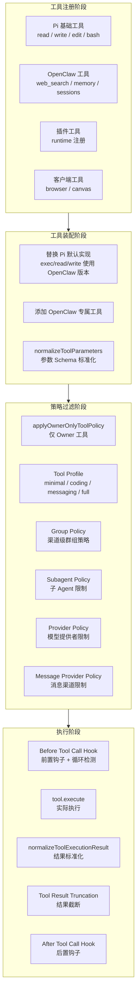

### 9.2 核心工具目录

```typescript
// src/agents/tool-catalog.ts
type ToolProfileId = "minimal" | "coding" | "messaging" | "full";
```

| 分类 | 工具 | Profile |
|------|------|---------|
| 文件系统 | `read`, `write`, `edit`, `apply_patch` | coding |
| 运行时 | `exec`, `process` | coding |
| 网络 | `web_search`, `web_fetch` | coding |
| 记忆 | `memory_search`, `memory_get` | coding |
| 会话 | `sessions_list`, `sessions_history`, `sessions_send`, `sessions_spawn`, `sessions_yield` | coding/messaging |
| 状态 | `session_status` | minimal |
| UI | `browser`, `canvas` | coding |
| 消息 | `message` | messaging |
| 自动化 | `cron` | coding |
| 节点 | `nodes`, `gateway` | coding |
| Agent | `agents_list`, `subagents` | coding |
| 媒体 | `image`, `tts` | coding |

### 9.3 工具组 (Tool Groups)

```typescript
// 按功能域分组
"group:fs"        // read, write, edit, apply_patch
"group:runtime"   // exec, process
"group:web"       // web_search, web_fetch
"group:memory"    // memory_search, memory_get
"group:sessions"  // sessions_*
"group:openclaw"  // 含 includeInOpenClawGroup 标记的工具
```

### 9.4 工具适配器 (Pi Tool Adapter)

将 OpenClaw 的 `AgentTool` 适配为 Pi SDK 的 `ToolDefinition`：

```typescript
// src/agents/pi-tool-definition-adapter.ts
export function toToolDefinitions(tools: AnyAgentTool[]): ToolDefinition[] {
  return tools.map((tool) => ({
    name: tool.name,
    label: tool.label ?? tool.name,
    description: tool.description ?? "",
    parameters: tool.parameters,
    execute: async (...args) => {
      // 1. 运行 before_tool_call Hook
      const hookOutcome = await runBeforeToolCallHook({
        toolName: name, params, toolCallId
      });
      if (hookOutcome.blocked) throw new Error(hookOutcome.reason);

      // 2. 执行工具
      const rawResult = await tool.execute(
        toolCallId, hookOutcome.params, signal, onUpdate
      );

      // 3. 标准化结果
      return normalizeToolExecutionResult({
        toolName, result: rawResult
      });
    },
  }));
}
```

### 9.5 循环检测机制

工具调用管线内置了 **循环检测** 防止 Agent 陷入死循环：

```typescript
// src/agents/pi-tools.before-tool-call.ts
// 检测关键循环 -> 阻断
// 检测警告循环 -> 节流警告

const LOOP_WARNING_BUCKET_SIZE = 10;
const MAX_LOOP_WARNING_KEYS = 256;

function shouldEmitLoopWarning(key: string): boolean {
  // 每 10 次同类调用发出一次警告
}
```

### 9.6 工具策略管线 (Policy Pipeline)

```typescript
// src/agents/tool-policy-pipeline.ts
export function applyToolPolicyPipeline(params: {
  tools: AnyAgentTool[];
  toolMeta: (tool) => { pluginId: string } | undefined;
  warn: (message: string) => void;
  steps: ToolPolicyPipelineStep[];
}): AnyAgentTool[]
```

策略按顺序应用，每一步都可以过滤或修改工具列表：

1. **Owner-only 策略**：非 Owner 用户移除敏感工具
2. **Profile 策略**：按 `minimal/coding/messaging/full` 过滤
3. **Group 策略**：群聊中限制工具集
4. **Subagent 策略**：子 Agent 自动 deny `gateway`、`agents_list` 等
5. **Provider 策略**：某些模型不支持特定工具（如 xAI deny `web_search`）
6. **Message Provider 策略**：语音通道 deny `tts`

### 9.7 工具结果截断

```typescript
// src/agents/pi-embedded-runner/tool-result-truncation.ts
export function truncateToolResultText(text: string, maxChars: number): string {
  // 保留头部 + 尾部，中间截断
}

export function calculateMaxToolResultChars(contextWindowTokens: number): number {
  // 上下文窗口的 30%
  return Math.floor(contextWindowTokens * TOOL_RESULT_CHARS_PER_TOKEN_ESTIMATE * 0.3);
}
```

---

## 十、Compaction 与 Context Pruning

### 10.1 压缩机制总览

当会话的 Token 数接近或超过上下文窗口时，OpenClaw 提供两种互补的策略：

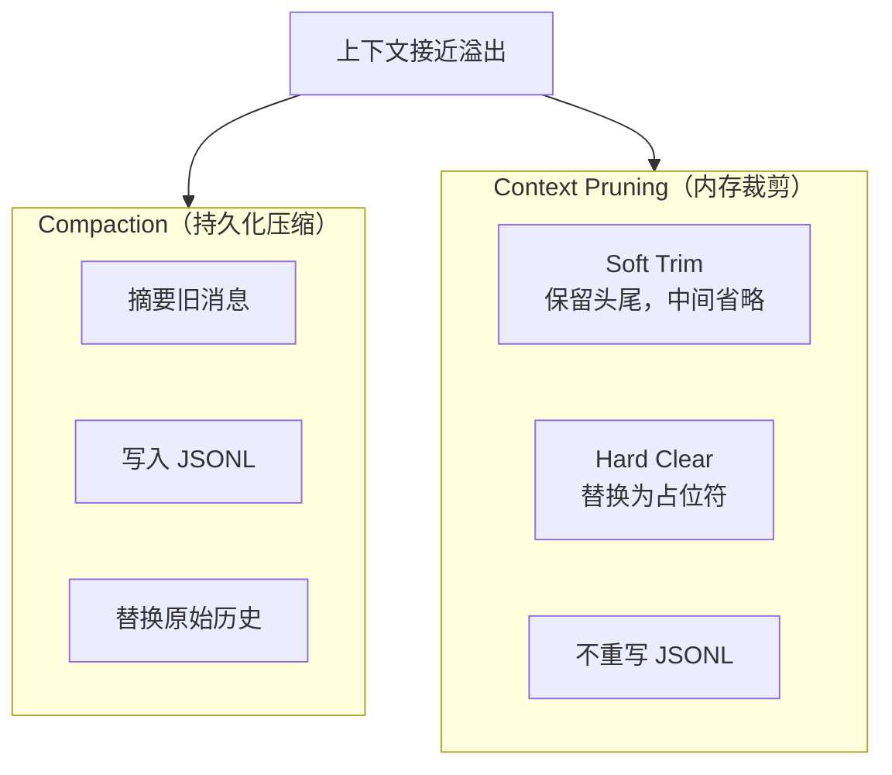

### 10.2 Compaction（持久化压缩）

**触发条件**：自动（上下文溢出）或手动（`/compact`）

**压缩流程**：

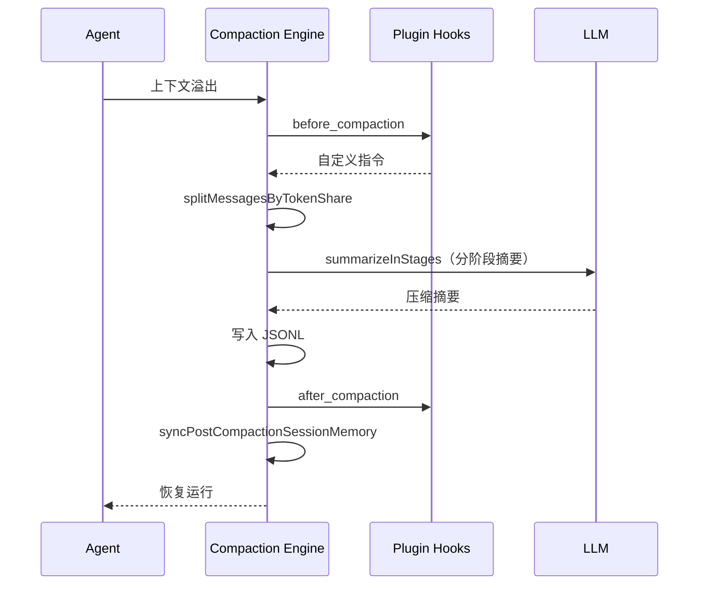

**核心函数**：

```typescript
// src/agents/compaction.ts
export function summarizeInStages(params): Promise<string>;
export function splitMessagesByTokenShare(messages, parts): AgentMessage[][];
export function chunkMessagesByMaxTokens(messages, maxTokens): AgentMessage[][];
export function computeAdaptiveChunkRatio(messages, contextWindow): number;
export function pruneHistoryForContextShare(params): {
  messages, droppedMessagesList, ...
};
```

**安全措施**：
- `stripToolResultDetails`：压缩时移除工具结果的 `details` 字段
- `repairToolUseResultPairing`：修复孤立的工具结果

### 10.3 Compaction Safeguard（增强压缩）

Compaction Safeguard 是标准压缩的增强版本：

```typescript
// src/agents/pi-embedded-runner/extensions.ts
// mode: "safeguard"
```

特性：
- **自适应 Token 预算**：根据实际上下文占用动态调整
- **保留最近轮次**：不压缩最近的 N 轮对话
- **工具失败摘要**：收集并保留工具调用失败的信息
- **结构化保留**：压缩摘要包含以下结构化 Section：
  - `## Decisions` - 已做决策
  - `## Open TODOs` - 待办事项
  - `## Constraints/Rules` - 约束规则
  - `## Pending user asks` - 用户未完成请求
  - `## Exact identifiers` - 精确标识符
- **质量守卫**：可配置重试次数检查压缩质量
- **Post-compaction 上下文恢复**：从 `AGENTS.md` 重新注入关键 Section

### 10.4 Context Pruning（内存裁剪）

不同于 Compaction 的持久化压缩，Pruning 仅在 **内存中** 裁剪工具结果：

```typescript
// src/agents/pi-extensions/context-pruning/pruner.ts
export function pruneContextMessages(params: {
  messages: AgentMessage[];
  settings: EffectiveContextPruningSettings;
  ctx: Pick<ExtensionContext, "model">;
  isToolPrunable?: (toolName: string) => boolean;
}): AgentMessage[]
```

**触发条件**：`mode: "cache-ttl"`，当距上次 Anthropic API 调用超过 TTL（默认 5 分钟）时触发。

**两阶段裁剪**：

| 阶段 | 条件 | 行为 |
|------|------|------|
| Soft Trim | 工具结果 > `softTrimRatio` 的上下文 | 保留头部 1,500 + 尾部 1,500 字符，中间插入 `...` |
| Hard Clear | 工具结果 > `hardClearRatio` 的上下文 | 替换为 `[Old tool result content cleared]` |

**保护规则**：
- 第一条用户消息：永不裁剪
- 最后 N 条 Assistant 消息：`keepLastAssistants`（默认 3）
- 包含图片的工具结果：跳过
- 最小可裁剪大小：`minPrunableToolChars`（默认 50,000）

**默认参数**：

```typescript
{
  ttl: "5m",
  keepLastAssistants: 3,
  softTrimRatio: 0.3,
  hardClearRatio: 0.5,
  minPrunableToolChars: 50000,
  softTrim: { maxChars: 4000, headChars: 1500, tailChars: 1500 },
  hardClear: { placeholder: "[Old tool result content cleared]" },
}
```

---

## 十一、队列与并发控制

### 11.1 命令队列架构

```typescript
// src/process/command-queue.ts
type LaneState = {
  lane: string;            // 队列标识
  queue: QueueEntry[];     // 等待队列
  activeTaskIds: Set<number>;  // 活跃任务
  maxConcurrent: number;   // 最大并发
  draining: boolean;       // 是否正在排空
  generation: number;      // 代次（用于清理）
};
```

### 11.2 核心 API

```typescript
// 在指定 Lane 排队执行
export function enqueueCommandInLane<T>(
  lane: string,
  task: () => Promise<T>,
  opts?: { warnAfterMs?: number; onWait?: WaitCallback }
): Promise<T>

// 设置 Lane 并发数
export function setCommandLaneConcurrency(
  lane: string, maxConcurrent: number
): void

// 标记 Gateway 排空中
export function markGatewayDraining(): void

// 等待所有活跃任务完成
export function waitForActiveTasks(
  timeoutMs: number
): Promise<{ drained: boolean }>
```

### 11.3 队列模式 (Queue Modes)

Agent 收到新消息时，如果当前已有运行中的 Agent Turn，按以下模式处理：

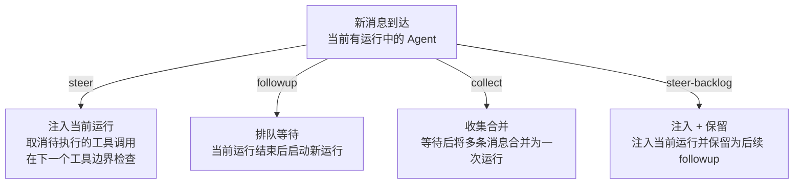

| 模式 | 行为 | 默认 |
|------|------|------|
| `steer` | 注入当前运行，取消待执行工具 | 否 |
| `followup` | 排队，当前结束后新运行 | 否 |
| `collect` | 收集多条合并为一次运行 | 是 |
| `steer-backlog` | 注入当前 + 保留 followup | 否 |

队列参数：
- `debounceMs`：等待去抖（默认 1,000ms）
- `cap`：每会话最大排队消息数（默认 20）
- `drop`：超出时策略 - `old`/`new`/`summarize`（默认 `summarize`）

---

## 十二、Hook 系统与插件扩展

### 12.1 Hook 运行器

```typescript
// src/plugins/hooks.ts
export function createHookRunner(
  registry: PluginRegistry,
  options?: HookRunnerOptions
): HookRunner
```

Hook 按优先级排序执行，分两种模式：
- **Void Hook**：并行执行，无返回值
- **Modifying Hook**：串行执行，每个 Hook 可修改输入并传递给下一个

### 12.2 完整 Hook 列表

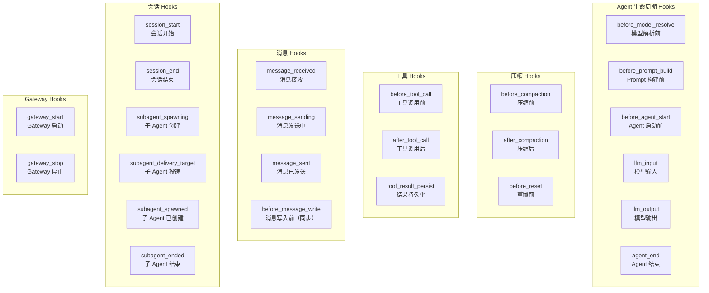

### 12.3 全局 Hook Runner

```typescript
// src/plugins/hook-runner-global.ts
export function initializeGlobalHookRunner(registry: PluginRegistry): void;
export function getGlobalHookRunner(): HookRunner | null;
export function hasGlobalHooks(hookName: string): boolean;
```

全局 Hook Runner 在 Gateway 启动时初始化，贯穿整个 Agent 运行时生命周期。

### 12.4 Hook 在 Agent 运行中的执行时序

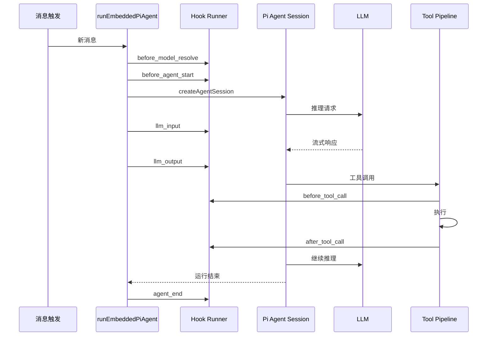

---

## 十三、Multi-Agent 架构

### 13.1 Agent 作用域

每个 Agent 拥有完全隔离的运行环境：

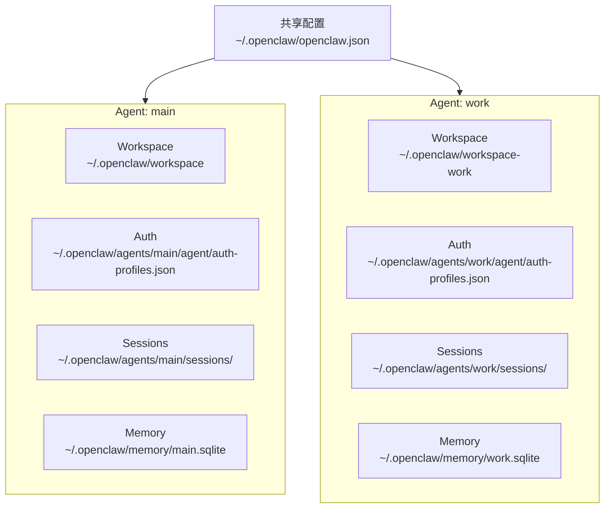

### 13.2 Agent 解析

```typescript
// src/agents/agent-scope.ts
type ResolvedAgentConfig = {
  name?: string;
  workspace?: string;
  agentDir?: string;
  model?: AgentEntry["model"];
  skills?: AgentEntry["skills"];
  memorySearch?: AgentEntry["memorySearch"];
  humanDelay?: AgentEntry["humanDelay"];
  heartbeat?: AgentEntry["heartbeat"];
  identity?: AgentEntry["identity"];
  groupChat?: AgentEntry["groupChat"];
  subagents?: AgentEntry["subagents"];
  sandbox?: AgentEntry["sandbox"];
  tools?: AgentEntry["tools"];
};

export function resolveAgentConfig(cfg, agentId): ResolvedAgentConfig;
export function resolveAgentWorkspaceDir(cfg, agentId): string;
export function resolveAgentDir(cfg, agentId): string;
```

### 13.3 消息路由

多 Agent 场景下，入站消息通过 **bindings** 路由到目标 Agent：

```json
{
  "agents": {
    "work": {
      "bindings": [
        {
          "peer": { "kind": "dm", "id": "+1234567890" },
          "channel": "whatsapp"
        }
      ]
    }
  }
}
```

同一 WhatsApp 号码可以通过不同的 DM sender 路由到不同的 Agent，实现 **一号多角色** 架构。

---

## 十四、关键设计模式与工程经验

### 14.1 延迟加载 (Lazy Loading)

工具依赖采用延迟加载，避免启动时加载所有渠道模块：

```typescript
// src/cli/deps.ts - Promise 化延迟加载
let _sendWhatsApp: Promise<SendFn> | null = null;
export function getSendWhatsApp() {
  if (!_sendWhatsApp) {
    _sendWhatsApp = import("../whatsapp/send.js")
      .then(m => m.sendMessageWhatsApp);
  }
  return _sendWhatsApp;
}
```

### 14.2 双层队列避免死锁

```
Session Lane (串行) --> Global Lane (有限并发)
                        Cron Lane -> Nested Lane (避免死锁)
```

Cron 任务映射到 `Nested` Lane，防止 Cron 触发的 Agent 运行与主 Lane 竞争导致死锁。

### 14.3 工具结果预算管理

上下文窗口是有限资源，OpenClaw 通过多层守卫管理：

```
Layer 1: Tool Result Truncation    - 单个工具结果截断（上下文 30%）
Layer 2: Tool Result Context Guard - 整体工具结果预算
Layer 3: Context Pruning           - Cache-TTL 裁剪旧工具结果
Layer 4: Compaction                - 持久化压缩历史
Layer 5: Context Window Guard      - 硬限制（最低 16K tokens）
```

### 14.4 安全分层

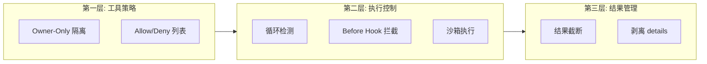

### 14.5 压缩后的上下文恢复

压缩会丢失上下文，Compaction Safeguard 通过以下机制恢复：

1. **Re-inject Bootstrap Sections**：从 `AGENTS.md` 重新注入关键 Section（如 "Session Startup"、"Red Lines"）
2. **结构化摘要**：保留决策、待办、约束等结构化信息
3. **精确标识符保留**：文件路径、API key 名称等精确标识符不被摘要化

### 14.6 事件订阅模型

`subscribeEmbeddedPiSession` 返回的是一个**事件订阅句柄**，而非简单的 Promise：

```typescript
const subscription = subscribeEmbeddedPiSession(params);

// 状态查询
subscription.isCompacting();
subscription.isCompactionInFlight();
subscription.getUsageTotals();
subscription.getCompactionCount();
subscription.getLastToolError();

// 消息追踪
subscription.didSendViaMessagingTool();
subscription.getMessagingToolSentTexts();
subscription.getMessagingToolSentMediaUrls();

// 清理
subscription.unsubscribe();
```

### 14.7 流式输出分层

```
Stream: "assistant"   - 模型文本输出
Stream: "tool"        - 工具调用事件
Stream: "lifecycle"   - 生命周期事件
  - phase: "start"    - Agent 开始
  - phase: "end"      - Agent 结束
  - phase: "error"    - Agent 错误
Stream: "compaction"  - 压缩事件
```

Block Streaming 模式下，输出按 `text_end`（文本段结束）或 `message_end`（消息结束）分块推送。

---

## 附录：源码索引

### Agent 运行时核心

| 文件 | 功能 |
|------|------|
| `src/agents/pi-embedded-runner/run.ts` | Agent 运行主入口 `runEmbeddedPiAgent` |
| `src/agents/pi-embedded-runner/run/attempt.ts` | 单次运行尝试 `runEmbeddedAttempt` |
| `src/agents/pi-embedded-subscribe.ts` | 事件订阅 `subscribeEmbeddedPiSession` |
| `src/agents/agent-scope.ts` | Agent 作用域解析 |
| `src/agents/agent-paths.ts` | Agent 目录路径 |
| `src/commands/agent.ts` | CLI Agent 命令入口 |

### System Prompt & Bootstrap

| 文件 | 功能 |
|------|------|
| `src/agents/system-prompt.ts` | System Prompt 装配 `buildAgentSystemPrompt` |
| `src/agents/pi-embedded-runner/system-prompt.ts` | 嵌入式 Prompt 构建 `buildEmbeddedSystemPrompt` |
| `src/agents/workspace.ts` | Workspace 文件加载 |
| `src/agents/bootstrap-files.ts` | Bootstrap 文件解析与过滤 |
| `src/agents/pi-embedded-helpers/bootstrap.ts` | Bootstrap 截断 `buildBootstrapContextFiles` |
| `src/agents/bootstrap-hooks.ts` | Bootstrap Hook 覆盖 |

### 工具管线

| 文件 | 功能 |
|------|------|
| `src/agents/pi-tools.ts` | 工具装配 `createOpenClawCodingTools` |
| `src/agents/pi-tool-definition-adapter.ts` | Pi 工具适配器 |
| `src/agents/tool-catalog.ts` | 工具目录与 Profile |
| `src/agents/tool-policy.ts` | Owner-only 策略 |
| `src/agents/tool-policy-pipeline.ts` | 策略管线 |
| `src/agents/pi-tools.policy.ts` | 策略解析（Profile/Provider/Group） |
| `src/agents/pi-tools.before-tool-call.ts` | 前置 Hook + 循环检测 |
| `src/agents/bash-tools.exec.ts` | Exec 工具（Shell 执行） |
| `src/agents/tools/memory-tool.ts` | Memory 工具定义 |
| `src/agents/pi-embedded-runner/tool-result-truncation.ts` | 结果截断 |
| `src/agents/pi-embedded-runner/tool-result-context-guard.ts` | 上下文预算守卫 |

### 上下文引擎 & 压缩

| 文件 | 功能 |
|------|------|
| `src/context-engine/types.ts` | ContextEngine 接口定义 |
| `src/context-engine/registry.ts` | 引擎注册与解析 |
| `src/agents/compaction.ts` | 压缩核心算法 |
| `src/agents/pi-embedded-runner/compact.ts` | 压缩协调（含 Hooks） |
| `src/agents/pi-embedded-runner/extensions.ts` | 扩展工厂（Safeguard + Pruning） |
| `src/agents/pi-extensions/context-pruning/pruner.ts` | Context Pruning 裁剪器 |

### 会话 & 记忆

| 文件 | 功能 |
|------|------|
| `src/agents/pi-embedded-runner/session-manager-cache.ts` | SessionManager 缓存 |
| `src/agents/pi-embedded-runner/session-manager-init.ts` | SessionManager 初始化 |
| `src/memory/manager.ts` | Memory Manager 核心 |
| `src/memory/search-manager.ts` | 搜索管理器 |
| `src/memory/manager-search.ts` | 向量/关键词搜索 |
| `src/memory/hybrid.ts` | 混合检索合并 |
| `src/memory/embeddings.ts` | 嵌入向量计算 |

### 队列 & Hook

| 文件 | 功能 |
|------|------|
| `src/process/command-queue.ts` | 命令队列 |
| `src/process/lanes.ts` | Lane 常量定义 |
| `src/agents/pi-embedded-runner/lanes.ts` | Lane 解析 |
| `src/plugins/hooks.ts` | Hook Runner 创建 |
| `src/plugins/hook-runner-global.ts` | 全局 Hook Runner |

---

> **学习建议**：建议从 `runEmbeddedPiAgent` 入手，沿着生命周期流程逐步深入各子系统。
> 重点关注 Tool Pipeline 的分层设计和 Compaction 的多策略选择——
> 这两个子系统体现了 OpenClaw 作为生产级 Agent 框架的工程深度。
