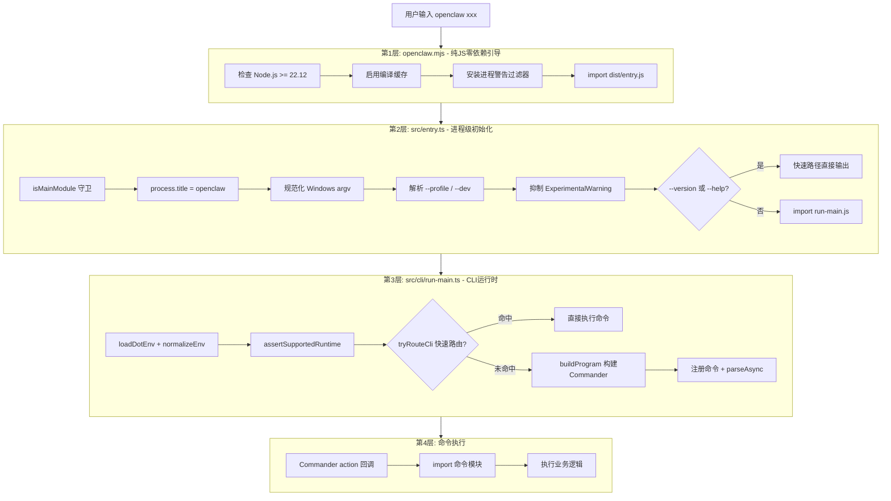
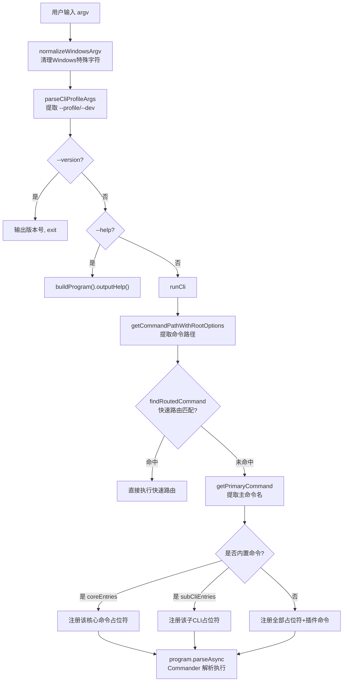

# OpenClaw CLI 底层实现原理

> 深入剖析 OpenClaw CLI 的启动链路、命令注册机制、识别与执行流程。
> 对应源码目录：`src/cli/`、`src/commands/`、`src/entry.ts`、`openclaw.mjs`

---

## 目录

- [一、CLI 启动链路](#一cli-启动链路)
- [二、三级命令注册机制](#二三级命令注册机制)
- [三、命令识别流程](#三命令识别流程)
- [四、命令执行流程](#四命令执行流程)
- [五、关键机制详解](#五关键机制详解)
- [六、完整流程示例](#六完整流程示例)
- [七、源码文件索引](#七源码文件索引)
- [八、设计总结](#八设计总结)

---

## 一、CLI 启动链路

OpenClaw CLI 从用户输入到命令执行经历**四层引导**，每一层只做必要的事，尽可能延迟加载：



### 第1层：`openclaw.mjs` -- 纯 JS 引导

这是 npm `bin` 指向的入口文件，**纯 JavaScript**（非 TypeScript），职责极简：

```javascript
// openclaw.mjs 核心逻辑（简化）
ensureSupportedNodeVersion();           // 1. Node >= 22.12 检查
module.enableCompileCache();            // 2. 启用编译缓存加速后续加载
await installProcessWarningFilter();    // 3. 过滤进程警告
await import("./dist/entry.js");        // 4. 进入 TypeScript 构建产物
```

**源码**：`openclaw.mjs`

**设计意图**：
- 纯 JS 保证在任何 Node 版本下都能运行版本检查
- 尝试 `dist/entry.js` 和 `dist/entry.mjs` 两种后缀，兼容不同构建配置
- 编译缓存 (`enableCompileCache`) 让后续 import 更快

### 第2层：`src/entry.ts` -- 进程初始化

```typescript
// src/entry.ts 核心逻辑（简化）
if (!isMainModule({ currentFile, wrapperEntryPairs })) {
  // 被作为依赖导入时跳过，防止重复执行
} else {
  process.title = "openclaw";
  normalizeEnv();
  process.argv = normalizeWindowsArgv(process.argv);    // Windows 特殊处理

  const parsed = parseCliProfileArgs(process.argv);     // 解析 --profile/--dev
  if (parsed.profile) applyCliProfileEnv(parsed);       // 设置隔离目录

  if (!ensureExperimentalWarningSuppressed()) {          // 可能 respawn
    if (!tryHandleRootVersionFastPath(process.argv) &&   // --version 快速路径
        !tryHandleRootHelpFastPath(process.argv)) {      // --help 快速路径
      import("./cli/run-main.js").then(m => m.runCli()); // 进入主流程
    }
  }
}
```

**源码**：`src/entry.ts`

**关键机制**：
- **isMainModule 守卫**：bundler 可能把 entry.ts 作为共享依赖导入，守卫防止 CLI 逻辑重复执行
- **Windows argv 规范化**：清理 Windows 下多余的 `node.exe` 路径和控制字符
- **Respawn 机制**：通过 `spawn` 子进程注入 `--disable-warning=ExperimentalWarning` flag
- **快速路径**：`--version` 和 `--help` 不加载完整 CLI 就能响应

### 第3层：`src/cli/run-main.ts` -- CLI 运行时

```typescript
// src/cli/run-main.ts runCli() 核心逻辑（简化）
export async function runCli(argv) {
  loadDotEnv({ quiet: true });             // 加载 .env
  normalizeEnv();                          // 环境变量规范化
  ensureOpenClawCliOnPath();               // 确保 openclaw 在 PATH 上
  assertSupportedRuntime();                // 运行时二次校验

  // 第一优先级：快速路由
  if (await tryRouteCli(argv)) return;

  // 第二优先级：Commander 完整解析
  enableConsoleCapture();
  const { buildProgram } = await import("./program.js");
  const program = buildProgram();

  // 按需注册主命令
  const primary = getPrimaryCommand(argv);
  if (primary) {
    await registerCoreCliByName(program, ctx, primary);
    await registerSubCliByName(program, primary);
  }

  // 注册插件命令（仅在需要时）
  if (!shouldSkipPluginRegistration) {
    registerPluginCliCommands(program, config);
  }

  await program.parseAsync(argv);
}
```

**源码**：`src/cli/run-main.ts`

### 第4层：命令执行

Commander 的 `.action()` 回调执行实际业务逻辑。业务代码统一放在 `src/commands/` 目录。

---

## 二、三级命令注册机制

OpenClaw 拥有 40+ 个子命令，但不会一次性全部加载。它使用**三级注册**策略：

```mermaid
flowchart LR
  subgraph level1 ["第一级: 快速路由"]
    R1["status"]
    R2["health"]
    R3["sessions"]
    R4["config get/unset"]
    R5["models list/status"]
    R6["agents list"]
    R7["memory status"]
  end

  subgraph level2 ["第二级: 核心命令 - 懒加载"]
    C1["setup"]
    C2["onboard"]
    C3["configure"]
    C4["config"]
    C5["agent / agents"]
    C6["message"]
    C7["doctor / dashboard"]
    C8["backup"]
    C9["memory"]
    C10["browser"]
  end

  subgraph level3 ["第三级: 子CLI + 插件 - 懒加载"]
    S1["gateway"]
    S2["channels"]
    S3["plugins"]
    S4["models"]
    S5["nodes / devices"]
    S6["cron / hooks"]
    S7["tui / logs"]
    S8["插件注册的命令"]
  end

  Input["用户输入"] --> level1
  level1 -->|"未命中"| level2
  level2 -->|"未命中"| level3
```



### 第一级：快速路由 -- 绕过 Commander

**源码**：`src/cli/program/routes.ts`、`src/cli/route.ts`

对于最高频的命令（status、health、config get 等），OpenClaw 直接手写 argv 解析，**完全跳过 Commander 的构建和解析开销**：

```typescript
// src/cli/program/routes.ts
const routeStatus: RouteSpec = {
  match: (path) => path[0] === "status",    // 匹配规则
  loadPlugins: true,                        // 是否预加载插件
  run: async (argv) => {                    // 直接执行
    const json = hasFlag(argv, "--json");
    const deep = hasFlag(argv, "--deep");
    const { statusCommand } = await import("../../commands/status.js");
    await statusCommand({ json, deep, ... });
    return true;
  },
};

// 所有快速路由
const routes: RouteSpec[] = [
  routeHealth,       // openclaw health
  routeStatus,       // openclaw status
  routeSessions,     // openclaw sessions
  routeAgentsList,   // openclaw agents list
  routeMemoryStatus, // openclaw memory status
  routeConfigGet,    // openclaw config get <path>
  routeConfigUnset,  // openclaw config unset <path>
  routeModelsList,   // openclaw models list
  routeModelsStatus, // openclaw models status
];
```

**路由匹配过程**：

```typescript
// src/cli/route.ts
export async function tryRouteCli(argv: string[]): Promise<boolean> {
  if (hasHelpOrVersion(argv)) return false;  // --help/--version 不走快速路由

  const path = getCommandPathWithRootOptions(argv, 2);  // 提取命令路径
  const route = findRoutedCommand(path);                 // 在路由表中查找
  if (!route) return false;                              // 未命中则回退 Commander

  // 命中：准备环境后直接执行
  await prepareRoutedCommand({ argv, commandPath: path, loadPlugins: route.loadPlugins });
  return route.run(argv);
}
```

快速路由的 `prepareRoutedCommand` 仍会执行 Banner 输出、配置校验、插件加载等必要步骤，但省去了 Commander 的整个构建-注册-解析链路。

### 第二级：核心命令 -- 懒加载占位符

**源码**：`src/cli/program/command-registry.ts`

核心命令（setup、agent、config、doctor 等）使用**懒加载占位符**模式：

```typescript
// src/cli/program/command-registry.ts
const coreEntries: CoreCliEntry[] = [
  {
    commands: [{ name: "setup", description: "Initialize local config...", hasSubcommands: false }],
    register: async ({ program }) => {
      const mod = await import("./register.setup.js");   // 延迟加载
      mod.registerSetupCommand(program);
    },
  },
  {
    commands: [
      { name: "agent", description: "Run one agent turn...", hasSubcommands: false },
      { name: "agents", description: "Manage isolated agents...", hasSubcommands: true },
    ],
    register: async ({ program, ctx }) => {
      const mod = await import("./register.agent.js");
      mod.registerAgentCommands(program, { agentChannelOptions: ctx.agentChannelOptions });
    },
  },
  // ... doctor, dashboard, message, memory, backup, browser, config ...
];
```

**懒加载占位符的工作原理**：

```typescript
function registerLazyCoreCommand(program, ctx, entry, command) {
  // 步骤1：注册一个"空壳"命令，只有 name + description
  const placeholder = program.command(command.name).description(command.description);
  placeholder.allowUnknownOption(true);    // 不校验选项（还不知道真实选项）
  placeholder.allowExcessArguments(true);  // 不校验参数

  // 步骤2：当用户实际调用时，placeholder 的 action 触发
  placeholder.action(async (...actionArgs) => {
    removeEntryCommands(program, entry);         // 2a. 移除占位符
    await entry.register({ program, ctx, argv }); // 2b. 动态 import 真实命令模块
    await reparseProgramFromActionArgs(program, actionArgs); // 2c. 重新解析 argv
  });
}
```

**智能优化**：如果已经从 argv 中确定了主命令名（如 `openclaw agent ...`），则只注册该命令的占位符，而不是全部 40+ 个：

```typescript
export function registerCoreCliCommands(program, ctx, argv) {
  const primary = getPrimaryCommand(argv);
  if (primary && shouldRegisterCorePrimaryOnly(argv)) {
    // 只找到并注册匹配的那一个
    const entry = coreEntries.find(e => e.commands.some(c => c.name === primary));
    if (entry) {
      registerLazyCoreCommand(program, ctx, entry, cmd);
      return;
    }
  }
  // 回退：注册全部占位符（--help 等场景）
  for (const entry of coreEntries) {
    for (const cmd of entry.commands) {
      registerLazyCoreCommand(program, ctx, entry, cmd);
    }
  }
}
```

### 第三级：子 CLI + 插件命令

**源码**：`src/cli/program/register.subclis.ts`、`src/plugins/cli.ts`

子 CLI 命令（gateway、channels、plugins、models 等）使用与核心命令相同的懒加载机制，但分开管理：

```typescript
// src/cli/program/register.subclis.ts
const entries: SubCliEntry[] = [
  { name: "gateway",   register: async (p) => { /* import gateway-cli */ } },
  { name: "channels",  register: async (p) => { /* import channels-cli */ } },
  { name: "plugins",   register: async (p) => { /* import plugins-cli */ } },
  { name: "models",    register: async (p) => { /* import models-cli */ } },
  { name: "nodes",     register: async (p) => { /* import nodes-cli */ } },
  { name: "cron",      register: async (p) => { /* import cron-cli */ } },
  { name: "tui",       register: async (p) => { /* import tui-cli */ } },
  { name: "logs",      register: async (p) => { /* import logs-cli */ } },
  { name: "dns",       register: async (p) => { /* import dns-cli */ } },
  { name: "skills",    register: async (p) => { /* import skills-cli */ } },
  { name: "update",    register: async (p) => { /* import update-cli */ } },
  // ... acp, daemon, system, approvals, devices, sandbox, hooks, webhooks, ...
];
```

**插件命令**则是在运行时从 `extensions/` 目录动态加载的：

```typescript
// src/plugins/cli.ts
export function registerPluginCliCommands(program, cfg) {
  const registry = loadOpenClawPlugins({ config, workspaceDir, ... });
  const existingCommands = new Set(program.commands.map(cmd => cmd.name()));

  for (const entry of registry.cliRegistrars) {
    // 防止插件命令与内置命令冲突
    const overlaps = entry.commands.filter(cmd => existingCommands.has(cmd));
    if (overlaps.length > 0) continue;

    entry.register({ program, config, workspaceDir, logger });
  }
}
```

---

## 三、命令识别流程

当用户输入一条命令时，OpenClaw 如何识别它？

### 3.1 argv 解析

**源码**：`src/cli/argv.ts`

OpenClaw 自己实现了一套轻量 argv 解析工具（不依赖 Commander），用于在 Commander 启动前做预判断：

```typescript
// 提取命令路径（跳过全局选项如 --dev、--profile）
getCommandPathWithRootOptions(argv, 2)
// 输入: ["node", "openclaw", "--dev", "gateway", "status", "--deep"]
// 输出: ["gateway", "status"]

// 提取主命令名
getPrimaryCommand(argv)
// 输入: ["node", "openclaw", "agent", "--message", "hi"]
// 输出: "agent"

// 检查是否有特定 flag
hasFlag(argv, "--json")      // true/false
hasHelpOrVersion(argv)        // 检查 -h/--help/-V/--version

// 获取 flag 的值
getFlagValue(argv, "--agent") // "main" 或 undefined
```

### 3.2 完整识别流程



### 3.3 命令名到模块的映射表

OpenClaw 的命令分三个注册表管理。每个命令名对应一个延迟加载的模块路径：

| 命令名 | 注册表 | 加载模块 |
|--------|--------|----------|
| `setup` | Core | `program/register.setup.js` |
| `onboard` | Core | `program/register.onboard.js` |
| `configure` | Core | `program/register.configure.js` |
| `config` | Core | `cli/config-cli.js` |
| `doctor` | Core | `program/register.maintenance.js` |
| `dashboard` | Core | `program/register.maintenance.js` |
| `agent` | Core | `program/register.agent.js` |
| `agents` | Core | `program/register.agent.js` |
| `message` | Core | `program/register.message.js` |
| `memory` | Core | `cli/memory-cli.js` |
| `backup` | Core | `program/register.backup.js` |
| `browser` | Core | `cli/browser-cli.js` |
| `gateway` | SubCLI | `cli/gateway-cli/register.js` |
| `channels` | SubCLI | `cli/channels-cli.js` |
| `plugins` | SubCLI | `cli/plugins-cli.js` |
| `models` | SubCLI | `cli/models-cli.js` |
| `nodes` | SubCLI | `cli/nodes-cli.js` |
| `devices` | SubCLI | `cli/devices-cli.js` |
| `logs` | SubCLI | `cli/logs-cli.js` |
| `cron` | SubCLI | `cli/cron-cli.js` |
| `hooks` | SubCLI | `cli/hooks-cli.js` |
| `tui` | SubCLI | `cli/tui-cli.js` |
| `skills` | SubCLI | `cli/skills-cli.js` |
| `update` | SubCLI | `cli/update-cli.js` |
| `pairing` | SubCLI | `cli/pairing-cli.js` |
| `sandbox` | SubCLI | `cli/sandbox-cli.js` |
| `dns` | SubCLI | `cli/dns-cli.js` |
| `security` | SubCLI | `cli/security-cli.js` |
| `acp` | SubCLI | `cli/acp-cli.js` |
| `system` | SubCLI | `cli/system-cli.js` |
| 插件命令 | Plugin | `plugins/cli.ts` 动态加载 |

---

## 四、命令执行流程

### 4.1 PreAction 钩子 -- 每个命令执行前的统一准备

**源码**：`src/cli/program/preaction.ts`

Commander 的 `program.hook("preAction", ...)` 在任何命令的 action 执行前触发：

```typescript
program.hook("preAction", async (_thisCommand, actionCommand) => {
  // 1. 设置进程标题（如 "openclaw-gateway"）
  setProcessTitleForCommand(actionCommand);

  // 2. 输出 Banner（🦞 OpenClaw 2026.3.13 -- 随机 tagline）
  //    --json 或 非 TTY 模式下跳过
  emitCliBanner(programVersion);

  // 3. 设置 verbose 和 log level
  setVerbose(getVerboseFlag(argv));
  if (cliLogLevel) process.env.OPENCLAW_LOG_LEVEL = cliLogLevel;

  // 4. 配置守卫：校验 openclaw.json
  //    配置无效时引导运行 doctor 修复
  //    doctor/backup/completion 等命令跳过此检查
  await ensureConfigReady({ runtime, commandPath });

  // 5. 按需加载插件注册表
  //    仅 message/channels/agents/configure/onboard/status/health 等命令需要
  if (PLUGIN_REQUIRED_COMMANDS.has(commandPath[0])) {
    ensurePluginRegistryLoaded();
  }
});
```

### 4.2 命令 action 的标准模式

每个命令的 action 遵循统一模式：

```typescript
// 以 "openclaw agent" 为例
// src/cli/program/register.agent.ts

program
  .command("agent")
  .description("Run an agent turn via the Gateway")
  .requiredOption("-m, --message <text>", "Message body")    // 必填选项
  .option("-t, --to <number>", "Recipient number")           // 可选选项
  .option("--agent <id>", "Agent id")
  .option("--local", "Run locally", false)
  .option("--json", "Output JSON", false)
  .action(async (opts) => {
    // 1. 处理选项
    setVerbose(opts.verbose === "on");
    const deps = createDefaultDeps();  // 懒加载依赖

    // 2. 包装在 runCommandWithRuntime 中统一错误处理
    await runCommandWithRuntime(defaultRuntime, async () => {
      // 3. 调用业务逻辑（在 src/commands/ 中）
      await agentCliCommand(opts, defaultRuntime, deps);
    });
  });
```

### 4.3 runCommandWithRuntime -- 统一错误处理

**源码**：`src/cli/cli-utils.ts`

```typescript
export async function runCommandWithRuntime(runtime, action, onError?) {
  try {
    await action();
  } catch (err) {
    if (onError) {
      onError(err);
      return;
    }
    runtime.error(String(err));
    runtime.exit(1);
  }
}
```

所有命令都通过这个包装器执行，确保未捕获的异常会被格式化输出并正确退出。

### 4.4 子命令树的注册

以 `openclaw gateway` 为例，它有多个子命令：

```typescript
// src/cli/gateway-cli/register.ts
export function registerGatewayCli(program: Command) {
  const gateway = program
    .command("gateway")
    .description("Run, inspect, and query the WebSocket Gateway")
    .option("--token <token>", "Gateway auth token")
    .option("--password <password>", "Gateway auth password");

  // 子命令 1: gateway run
  addGatewayRunCommand(gateway);

  // 子命令 2: gateway status
  gateway.command("status")
    .description("Show gateway service and channel status")
    .option("--deep", "Probe channel connections")
    .option("--json", "Output JSON")
    .action(async (opts, command) => { ... });

  // 子命令 3: gateway discover
  gateway.command("discover")
    .description("Find local and wide-area gateway beacons")
    .action(async (opts) => { ... });

  // 子命令 4-N: install, uninstall, start, stop, restart, call, probe, ...
  addGatewayServiceCommands(gateway);
}
```

Commander 会自动处理子命令的路由，例如 `openclaw gateway status --deep` 会匹配到 `gateway` 下的 `status` 子命令。

### 4.5 选项继承

**源码**：`src/cli/command-options.ts`

子命令可以继承父命令的选项值（如 `--token`）：

```typescript
export function inheritOptionFromParent<T>(command, name): T | undefined {
  // 如果子命令自己没有显式设置该选项
  // 则向上遍历父命令（最多2层），查找显式设置的值
  let ancestor = command.parent;
  while (ancestor && depth < MAX_INHERIT_DEPTH) {
    const source = getOptionSource(ancestor, name);
    if (source && source !== "default") {
      return ancestor.opts()[name];
    }
    ancestor = ancestor.parent;
    depth++;
  }
  return undefined;
}
```

这样 `openclaw gateway --token xxx status` 中的 `--token` 会被 `status` 子命令继承。

---

## 五、关键机制详解

### 5.1 Respawn 机制

**源码**：`src/entry.ts`

Node.js 的 `--disable-warning=ExperimentalWarning` flag 必须作为 Node CLI 参数传入，不能通过 `NODE_OPTIONS` 设置。OpenClaw 用 respawn（自我重启）解决：

```
第一次运行: node openclaw.mjs gateway
  → 发现缺少 --disable-warning
  → spawn("node", ["--disable-warning=ExperimentalWarning", "openclaw.mjs", "gateway"])
  → 父进程等待子进程退出
  → 子进程检测到 OPENCLAW_NODE_OPTIONS_READY=1，不再 respawn

环境变量守卫（防止无限递归）:
  OPENCLAW_NODE_OPTIONS_READY=1
  OPENCLAW_NO_RESPAWN=1（可手动禁用）
```

### 5.2 Profile 隔离

**源码**：`src/cli/profile.ts`

`--profile` 和 `--dev` 在所有其他参数之前解析，通过修改环境变量实现完全隔离：

```
openclaw --dev gateway         → OPENCLAW_STATE_DIR=~/.openclaw-dev
                                 OPENCLAW_CONFIG_PATH=~/.openclaw-dev/openclaw.json
                                 OPENCLAW_GATEWAY_PORT=19001

openclaw --profile test agent  → OPENCLAW_STATE_DIR=~/.openclaw-test
                                 OPENCLAW_CONFIG_PATH=~/.openclaw-test/openclaw.json
```

这使得你可以在同一台机器上运行多个完全隔离的 OpenClaw 实例。

### 5.3 懒加载占位符 + 重解析

**源码**：`src/cli/program/action-reparse.ts`

占位符被触发后，真实命令模块注册完毕，需要**重新解析** argv，让 Commander 用真实的选项/参数定义来解析：

```typescript
export async function reparseProgramFromActionArgs(program, actionArgs) {
  const actionCommand = actionArgs.at(-1) as Command;
  const rawArgs = actionCommand?.parent?.rawArgs;
  const parseArgv = buildParseArgv({ programName, rawArgs, fallbackArgv });
  await program.parseAsync(parseArgv);  // 用真实命令定义重新解析
}
```

这个「注册占位符 → 触发时替换为真实命令 → 重新解析」的流程是 OpenClaw 懒加载的核心技巧。

### 5.4 配置守卫

**源码**：`src/cli/program/config-guard.ts`

在命令执行前自动校验 `openclaw.json` 的有效性：

```
ensureConfigReady()
  → readConfigFileSnapshot()     读取配置
  → 如果配置有效 → 通过
  → 如果配置无效：
    → 某些命令允许绕过（doctor, logs, health, status, backup）
    → gateway 的部分子命令允许绕过（status, probe, install...）
    → 其他命令 → 自动运行 doctor 流程引导修复
```

### 5.5 依赖注入（CliDeps）

**源码**：`src/cli/deps.ts`

渠道发送函数通过代理模式延迟加载：

```typescript
export function createDefaultDeps(): CliDeps {
  return {
    sendMessageWhatsApp: async (...args) => {
      // 首次调用时才 import Baileys 相关模块
      const { sendMessageWhatsApp } = await import("./deps-send-whatsapp.runtime.js");
      return await sendMessageWhatsApp(...args);
    },
    sendMessageTelegram: async (...args) => {
      const { sendMessageTelegram } = await import("./deps-send-telegram.runtime.js");
      return await sendMessageTelegram(...args);
    },
    // Discord, Slack, Signal, iMessage 同理
  };
}
```

这避免了 CLI 启动时加载所有重量级渠道依赖（Baileys/grammY/discord.js 等）。只有当命令需要发送消息时，对应渠道的依赖才会被加载。

### 5.6 Banner 输出

**源码**：`src/cli/banner.ts`

CLI 启动时显示的 Banner（`🦞 OpenClaw 2026.3.13 (abc1234) -- tagline`）有几个设计细节：

- TTY 检测：非终端（管道/重定向）不输出
- `--json` flag：JSON 输出模式不显示 Banner
- 单次输出：`bannerEmitted` 标志防止重复
- 终端宽度自适应：太长时自动换行
- 颜色主题：支持 rich/plain 两种模式
- 可配置的 tagline：`cli.banner.taglineMode`（random/default/off）

---

## 六、完整流程示例

### 示例 1：`openclaw status --deep --json`（快速路由命中）

```
1. openclaw.mjs
   → Node 22.12 检查通过 → import("dist/entry.js")

2. entry.ts
   → isMainModule = true
   → normalizeWindowsArgv
   → parseCliProfileArgs → 无 profile
   → 不需要 respawn
   → 不是 --version/--help
   → import("cli/run-main.js").runCli(argv)

3. run-main.ts runCli()
   → loadDotEnv, normalizeEnv
   → tryRouteCli(argv)
     → getCommandPathWithRootOptions → ["status"]
     → findRoutedCommand(["status"]) → routeStatus 命中
     → prepareRoutedCommand:
       → emitCliBanner (被 --json 抑制，不输出)
       → ensureConfigReady (校验配置)
       → ensurePluginRegistryLoaded (加载插件注册表)
     → routeStatus.run(argv):
       → hasFlag("--json") = true
       → hasFlag("--deep") = true
       → import("commands/status.js")
       → statusCommand({ json: true, deep: true })
   → 返回 true，流程结束，Commander 从未构建
```

### 示例 2：`openclaw agent --message "hello" --to +1234`（Commander 路径）

```
1. openclaw.mjs → entry.ts → runCli()

2. tryRouteCli(argv)
   → getCommandPathWithRootOptions → ["agent"]
   → findRoutedCommand(["agent"]) → null，未命中快速路由

3. buildProgram():
   → new Command()
   → createProgramContext() → 读取 VERSION、渠道选项
   → configureProgramHelp() → 设置 help 格式
   → registerPreActionHooks() → 注册 preAction 钩子
   → registerProgramCommands():
     → getPrimaryCommand(argv) → "agent"
     → registerCoreCliCommands → 只为 "agent" 注册占位符
     → registerSubCliCommands → 只为 "agent" 注册（未找到，跳过）

4. program.parseAsync(argv):
   → Commander 匹配到 "agent" 占位符
   → 占位符 action 触发:
     → removeEntryCommands → 移除占位符
     → import("program/register.agent.js")
     → registerAgentCommands(program) → 注册真实的 agent 命令（含所有选项）
     → reparseProgramFromActionArgs → 用真实命令定义重新解析 argv

5. 重新解析后 Commander 匹配到真实的 agent 命令:
   → preAction 钩子:
     → process.title = "openclaw-agent"
     → emitCliBanner() → "🦞 OpenClaw 2026.3.13 (abc1234)"
     → setVerbose(false)
     → ensureConfigReady() → 配置有效，通过
   → agent action:
     → createDefaultDeps() → 创建懒加载依赖
     → runCommandWithRuntime:
       → agentCliCommand(opts, runtime, deps)
       → callGateway("agent", { message: "hello", to: "+1234" })
```

### 示例 3：`openclaw --dev gateway run --port 19001`（Profile + 子CLI）

```
1. entry.ts:
   → parseCliProfileArgs → profile = "dev"
   → applyCliProfileEnv:
     → OPENCLAW_STATE_DIR = ~/.openclaw-dev
     → OPENCLAW_CONFIG_PATH = ~/.openclaw-dev/openclaw.json
     → OPENCLAW_GATEWAY_PORT = 19001
   → 从 argv 中移除 --dev

2. runCli():
   → tryRouteCli → findRoutedCommand(["gateway", "run"]) → null
   → buildProgram()
   → getPrimaryCommand → "gateway"
   → registerSubCliByName(program, "gateway"):
     → import("cli/gateway-cli/register.js")
     → registerGatewayCli(program) → 注册 gateway 及其所有子命令
   → program.parseAsync(argv)

3. Commander 匹配: gateway → run
   → preAction: banner + config guard
   → gateway run action: 启动 Gateway 进程
```

---

## 七、源码文件索引

### 启动链路

| 文件 | 职责 |
|------|------|
| `openclaw.mjs` | 纯 JS 引导：Node 版本检查、编译缓存 |
| `src/entry.ts` | 进程初始化：respawn、profile、快速路径 |
| `src/cli/run-main.ts` | CLI 运行时：快速路由、buildProgram、parseAsync |

### 命令注册

| 文件 | 职责 |
|------|------|
| `src/cli/program/build-program.ts` | 构建 Commander 程序实例 |
| `src/cli/program/command-registry.ts` | 核心命令注册表（懒加载占位符） |
| `src/cli/program/register.subclis.ts` | 子 CLI 注册表（懒加载占位符） |
| `src/plugins/cli.ts` | 插件命令动态注册 |
| `src/cli/program/command-tree.ts` | 命令树操作（移除/替换占位符） |
| `src/cli/program/action-reparse.ts` | 占位符触发后的 argv 重解析 |

### 命令识别

| 文件 | 职责 |
|------|------|
| `src/cli/argv.ts` | 轻量 argv 解析工具集 |
| `src/cli/route.ts` | 快速路由入口 |
| `src/cli/program/routes.ts` | 快速路由表定义 |
| `src/cli/windows-argv.ts` | Windows argv 规范化 |
| `src/cli/profile.ts` | --profile / --dev 解析与隔离 |
| `src/cli/respawn-policy.ts` | Respawn 策略判断 |

### 命令执行

| 文件 | 职责 |
|------|------|
| `src/cli/program/preaction.ts` | PreAction 钩子（banner/config/plugins） |
| `src/cli/program/context.ts` | 程序上下文（version/渠道选项） |
| `src/cli/program/help.ts` | 帮助信息格式化 |
| `src/cli/program/config-guard.ts` | 配置有效性守卫 |
| `src/cli/cli-utils.ts` | 统一错误处理包装器 |
| `src/cli/deps.ts` | 懒加载依赖注入（CliDeps） |
| `src/cli/banner.ts` | CLI Banner 输出 |
| `src/cli/command-options.ts` | 选项继承（子命令继承父命令选项） |

### 具体命令注册模块

| 文件 | 命令 |
|------|------|
| `src/cli/program/register.agent.ts` | `agent` / `agents` |
| `src/cli/program/register.setup.ts` | `setup` |
| `src/cli/program/register.onboard.ts` | `onboard` |
| `src/cli/program/register.configure.ts` | `configure` |
| `src/cli/program/register.maintenance.ts` | `doctor` / `dashboard` / `reset` / `uninstall` |
| `src/cli/program/register.message.ts` | `message` |
| `src/cli/program/register.backup.ts` | `backup` |
| `src/cli/gateway-cli/register.ts` | `gateway` (run/status/discover...) |
| `src/cli/channels-cli.ts` | `channels` |
| `src/cli/plugins-cli.ts` | `plugins` |
| `src/cli/models-cli.ts` | `models` |
| `src/cli/nodes-cli.ts` | `nodes` |

### 业务逻辑

| 目录 | 职责 |
|------|------|
| `src/commands/` | 所有命令的业务实现（296 个文件） |
| `src/commands/agent.ts` | agent 命令的核心逻辑 |
| `src/commands/agent-via-gateway.ts` | 通过 Gateway RPC 执行 agent |
| `src/commands/status.ts` | status 命令 |
| `src/commands/health.ts` | health 命令 |
| `src/commands/agents.ts` | agents 管理命令 |

---

## 八、设计总结

### 性能优化手段

| 手段 | 目的 | 影响 |
|------|------|------|
| Node 编译缓存 | 减少 JS 解析开销 | 全局 |
| 快速路由 | 高频命令跳过 Commander | status/health 等 |
| 懒加载占位符 | 只加载用到的命令模块 | 全部命令 |
| 仅注册主命令 | argv 已知时只注册一个占位符 | 启动时 |
| 依赖代理 | 渠道库按需加载 | 发送消息时 |
| Respawn 一次性 | 环境变量防止重复 respawn | 启动时 |
| --version/--help 快速路径 | 跳过全部初始化直接输出 | 帮助/版本查询 |

### 关键设计模式

| 模式 | 应用 |
|------|------|
| **分层引导** | 4 层启动链路，每层只做必要工作 |
| **懒加载占位符** | 注册空壳命令，触发时替换为真实命令并重解析 |
| **快速路由** | 高频命令绕过 Commander 直接执行 |
| **代理模式** | CliDeps 中的渠道发送函数延迟加载 |
| **Profile 隔离** | 通过环境变量实现多实例共存 |
| **PreAction 钩子** | 统一的命令前准备（banner/配置/插件） |
| **配置守卫** | 命令执行前自动校验配置，引导修复 |
| **统一错误处理** | runCommandWithRuntime 包装所有命令 |

### 为什么不直接用 Commander 原生方式？

原生 Commander 的做法是在启动时一次性 import 并注册所有命令。对于 40+ 个命令、依赖数十个重量级 npm 包的 CLI 来说：
- **启动时间**：一次性加载所有命令模块 + 依赖会让 `openclaw status` 这种简单查询也要等几秒
- **内存占用**：加载 Baileys(WhatsApp)、grammY(Telegram)、discord.js 等大型库会浪费大量内存
- **跨平台差异**：Windows 的 argv、Node 版本、ESM 警告等需要在 Commander 之前处理

OpenClaw 的三级注册 + 快速路由设计让一个复杂的大型 CLI 保持了快速的冷启动速度，是值得学习的工程实践。
