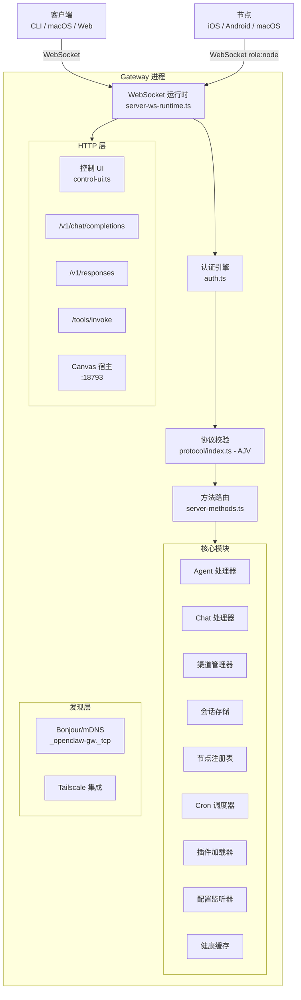
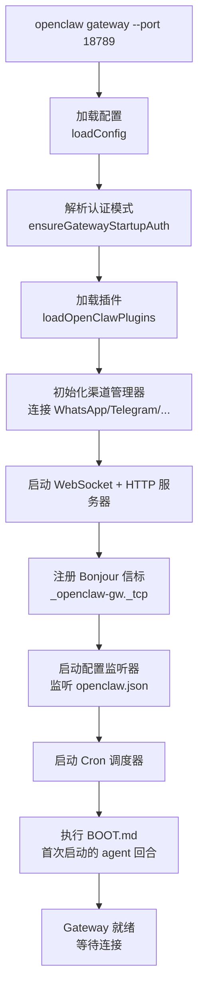
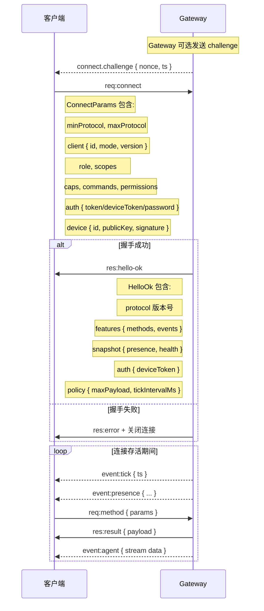
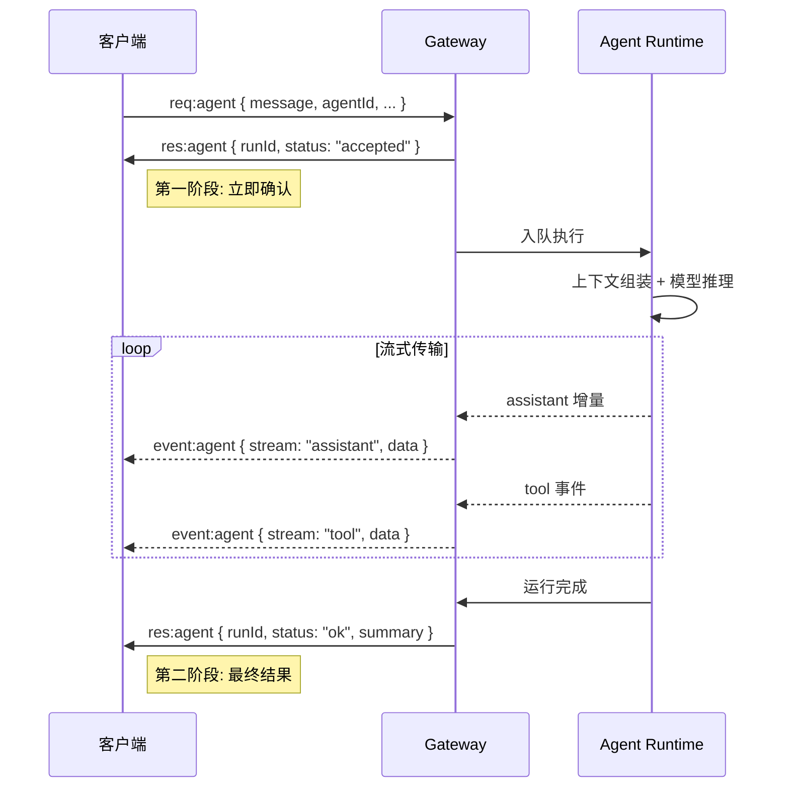
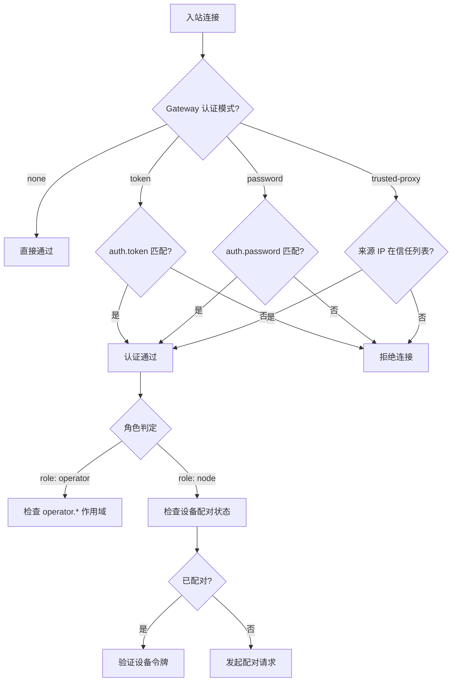
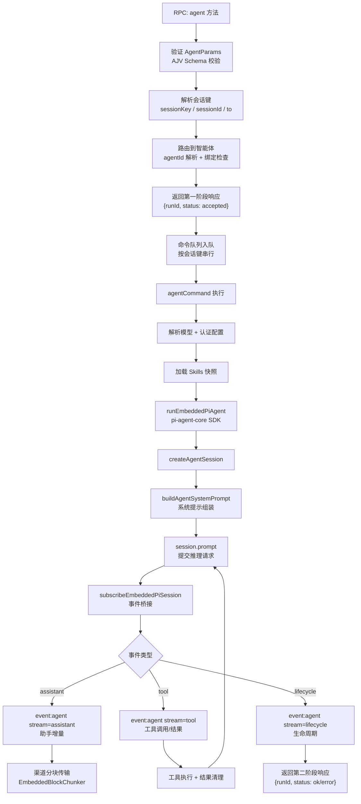
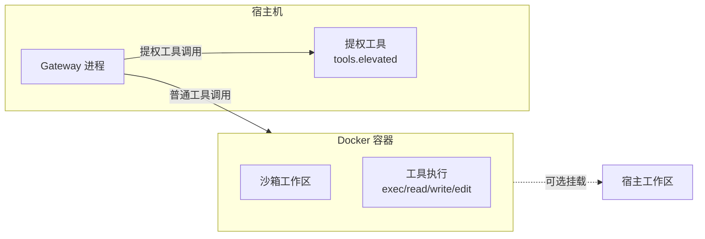
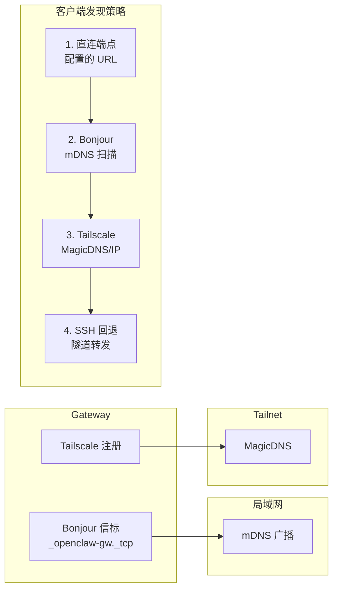

# OpenClaw Gateway 原理与协议

> 深入剖析 Gateway 的架构设计、WebSocket 协议、RPC 方法、安全模型和 Agent 运行机制。
> 对应源码目录：`src/gateway/`，文档：`docs/zh-CN/gateway/`

---

## 目录

- [一、Gateway 架构总览](#一gateway-架构总览)
- [二、启动与生命周期](#二启动与生命周期)
- [三、WebSocket 协议](#三websocket-协议)
- [四、RPC 方法与服务端处理](#四rpc-方法与服务端处理)
- [五、认证与安全模型](#五认证与安全模型)
- [六、节点注册与设备配对](#六节点注册与设备配对)
- [七、Agent 运行时集成](#七agent-运行时集成)
- [八、HTTP API 层](#八http-api-层)
- [九、配置热重载](#九配置热重载)
- [十、健康检查与探针](#十健康检查与探针)
- [十一、沙箱隔离](#十一沙箱隔离)
- [十二、钩子系统](#十二钩子系统)
- [十三、设备发现](#十三设备发现)
- [十四、核心源码索引](#十四核心源码索引)

---

## 一、Gateway 架构总览

### 1.1 定位与设计原则

Gateway 是 OpenClaw 的**核心守护进程**，采用**单进程架构**：

| 设计原则 | 实现 |
|----------|------|
| 单一数据源 | 每台主机只有一个 Gateway，拥有所有渠道连接 |
| 统一传输层 | WebSocket 作为控制平面和节点传输的唯一通道 |
| 类型安全协议 | TypeBox 定义协议 Schema，AJV 做运行时验证 |
| 端口复用 | WebSocket + HTTP API 共享同一端口（默认 18789） |
| 角色分离 | 操作员（控制平面）和节点（能力宿主）分离 |

### 1.2 进程内架构



### 1.3 端口与服务

| 服务 | 默认端口 | 说明 |
|------|----------|------|
| WebSocket + HTTP | 18789 | 控制平面 + HTTP API 共用端口 |
| Canvas 宿主 | 18793 | A2UI/Canvas HTML 文件服务 |
| Bridge (已废弃) | 18790 | 旧版 TCP JSONL 传输 |

Dev 模式 (`--dev`)：端口偏移到 19001/19005。

---

## 二、启动与生命周期

### 2.1 启动流程



### 2.2 单例保护 -- Gateway Lock

Gateway 使用**端口排他绑定**作为锁机制：

```
单例保护策略:
├── 机制: 在 WebSocket 端口上创建独占 TCP 监听器
├── 冲突检测: 绑定失败 → EADDRINUSE → GatewayLockError
├── 自动清理: 进程退出时 OS 自动释放端口
├── 优势: 无锁文件 → 无残留文件 → 崩溃安全
└── --force: 可强制释放已占用端口后重新绑定
```

**源码**：`src/gateway/gateway-lock.ts`

### 2.3 BOOT.md -- 启动时 Agent 回合

**源码**：`src/gateway/boot.ts`

Gateway 启动后会检查工作区中的 `BOOT.md` 文件并执行一次 agent 回合：

```typescript
type BootRunResult =
  | { status: "skipped"; reason: "missing" | "empty" }
  | { status: "ran" }
  | { status: "failed"; reason: string };

async function runBootOnce(params) {
  const bootFile = loadBootFile(workspaceDir);      // 读取 BOOT.md
  if (bootFile.status !== "ok") return { status: "skipped" };

  const sessionId = generateBootSessionId();         // boot-2026-03-14_12-30-45-...
  const prompt = buildBootPrompt(bootFile.content);  // 构建启动提示
  snapshotMainSessionMapping();                      // 快照会话映射

  await agentCommand({ message: prompt, sessionId,
    deliver: false, senderIsOwner: true });           // 执行 agent 回合

  restoreMainSessionMapping();                        // 恢复会话映射
  return { status: "ran" };
}
```

---

## 三、WebSocket 协议

### 3.1 协议概述

| 特性 | 说明 |
|------|------|
| 传输 | WebSocket，JSON 文本帧 |
| 协议版本 | `PROTOCOL_VERSION = 3` |
| 事实来源 | TypeBox Schema (`src/gateway/protocol/schema/`) |
| 运行时校验 | AJV (`src/gateway/protocol/index.ts`) |
| 代码生成 | JSON Schema + Swift 模型 |

### 3.2 帧类型

协议定义三种帧，由 `type` 字段区分：

```typescript
// Request 帧 -- 客户端 → 服务端
type RequestFrame = {
  type: "req";
  id: string;          // 请求唯一 ID
  method: string;      // RPC 方法名
  params?: object;     // 方法参数
};

// Response 帧 -- 服务端 → 客户端
type ResponseFrame = {
  type: "res";
  id: string;          // 对应请求 ID
  ok: boolean;         // 是否成功
  payload?: object;    // 成功时的返回数据
  error?: ErrorShape;  // 失败时的错误信息
};

// Event 帧 -- 服务端 → 客户端（推送）
type EventFrame = {
  type: "event";
  event: string;       // 事件名称
  payload?: object;    // 事件数据
  seq?: number;        // 序列号（Gap 检测用）
  stateVersion?: StateVersion;  // 状态版本
};

// 错误结构
type ErrorShape = {
  code: string;        // 错误码
  message: string;     // 错误描述
  details?: object;    // 附加信息
  retryable?: boolean; // 是否可重试
  retryAfterMs?: number;
};
```

### 3.3 连接握手



### 3.4 ConnectParams 详解

```typescript
type ConnectParams = {
  // 协议版本协商
  minProtocol: number;        // 客户端支持的最低版本
  maxProtocol: number;        // 客户端支持的最高版本

  // 客户端身份
  client: {
    id: string;               // 客户端唯一 ID
    displayName?: string;     // 可读名称
    version: string;          // 客户端版本号
    platform: string;         // 平台标识
    deviceFamily?: string;    // 设备系列（如 iPhone15,2）
    modelIdentifier?: string; // 型号标识
    mode: string;             // 运行模式
    instanceId?: string;      // 实例 ID（多窗口区分）
  };

  // 角色与权限
  role?: "operator" | "node"; // 默认 operator
  scopes?: string[];          // 权限作用域

  // 节点能力（仅 role:node）
  caps?: string[];            // 能力列表（如 camera.photo, screen.record）
  commands?: object[];        // 可调用命令
  permissions?: object;       // 权限声明
  pathEnv?: string[];         // PATH 环境变量

  // 认证
  auth?: {
    token?: string;           // Gateway 认证令牌
    bootstrapToken?: string;  // 引导令牌（首次配对）
    deviceToken?: string;     // 设备令牌（已配对设备）
    password?: string;        // 密码认证
  };

  // 设备身份（配对用）
  device?: {
    id: string;               // 设备 ID（keypair 指纹）
    publicKey: string;        // 公钥
    signature: string;        // 签名
    signedAt: number;         // 签名时间戳
    nonce: string;            // 服务端挑战 nonce
  };

  locale?: string;            // 区域设置
  userAgent?: string;         // User-Agent
};
```

### 3.5 HelloOk -- 服务端响应

```typescript
type HelloOk = {
  type: "hello-ok";
  protocol: number;           // 协商后的协议版本

  server: {
    version: string;          // 服务端版本号
    connId: string;           // 连接 ID
  };

  features: {
    methods: string[];        // 支持的 RPC 方法列表
    events: string[];         // 支持的事件列表
  };

  snapshot: Snapshot;          // 当前状态快照

  canvasHostUrl?: string;      // Canvas 宿主 URL

  auth?: {
    deviceToken: string;       // 颁发的设备令牌
    role: string;              // 授予的角色
    scopes: string[];          // 授予的作用域
    issuedAtMs?: number;       // 颁发时间
  };

  policy: {
    maxPayload: number;        // 最大帧大小（字节）
    maxBufferedBytes: number;  // 最大缓冲区
    tickIntervalMs: number;    // 心跳间隔
  };
};

type Snapshot = {
  presence: PresenceEntry[];   // 所有在线客户端/节点
  health: object;              // 渠道健康快照
  stateVersion: StateVersion;  // 状态版本号
  uptimeMs: number;            // 进程运行时间
  configPath: string;          // 配置文件路径
  stateDir: string;            // 状态目录
  sessionDefaults: {
    defaultAgentId: string;
    mainKey: string;
    mainSessionKey: string;
    scope: string;
  };
  authMode: "none" | "token" | "password" | "trusted-proxy";
  updateAvailable?: object;
};
```

### 3.6 TypeBox -- 协议的唯一事实来源

```
TypeBox Schema 定义
  ├── src/gateway/protocol/schema/*.ts     -- 分模块定义
  ├── src/gateway/protocol/schema.ts       -- 统一导出
  │
  ├── → AJV 编译验证器                     -- 运行时校验入站帧
  │     src/gateway/protocol/index.ts
  │
  ├── → JSON Schema 导出                   -- dist/protocol.schema.json
  │     pnpm protocol:gen
  │
  └── → Swift 模型生成                     -- apps/macos/Sources/...
        pnpm protocol:gen:swift

Schema 模块划分:
  agent.ts            -- Agent 调用/等待/唤醒
  frames.ts           -- 帧结构、connect、hello-ok
  nodes.ts            -- 节点配对、调用、事件
  sessions.ts         -- 会话列表/预览/重置/压缩
  channels.ts         -- 渠道状态、Web 登录
  config.ts           -- 配置读写
  cron.ts             -- 定时任务
  devices.ts          -- 设备配对和令牌管理
  snapshot.ts         -- Presence、Health、StateVersion
  error-codes.ts      -- 错误码定义
  protocol-schemas.ts -- 中央 Schema 注册表
  types.ts            -- TypeScript 类型导出（Static<typeof Schema>）
```

### 3.7 协议校验

**源码**：`src/gateway/protocol/index.ts`

使用 AJV（Another JSON Schema Validator）编译 TypeBox Schema 为高性能验证函数：

```typescript
// AJV 配置
const ajv = new Ajv({
  allErrors: true,            // 收集所有错误（不是第一个就停止）
  strict: false,              // 允许非标准 Schema 关键字
  removeAdditional: false,    // 不自动移除额外属性
});

// 编译后的验证器（部分）
validateConnectParams(data)        // 验证 connect 参数
validateRequestFrame(data)         // 验证请求帧
validateResponseFrame(data)        // 验证响应帧
validateEventFrame(data)           // 验证事件帧
validateSendParams(data)           // 验证 send 参数
validateAgentParams(data)          // 验证 agent 参数
validateAgentWaitParams(data)      // 验证 agent.wait 参数
validateNodeInvokeParams(data)     // 验证 node.invoke 参数
validateSessionsListParams(data)   // 验证 sessions.list 参数
validateConfigSetParams(data)      // 验证 config.set 参数
// ... 更多

// 错误格式化
function formatValidationErrors(errors: ErrorObject[]): string {
  // 处理 additionalProperties 错误
  // 去重错误消息
  // 返回人类可读的错误描述
}
```

---

## 四、RPC 方法与服务端处理

### 4.1 方法分类

**源码**：`src/gateway/server-methods.ts`

```typescript
const coreGatewayHandlers = {
  // ─── 系统方法 ───
  "connect":            connectHandler,
  "health":             healthHandler,
  "system-presence":    systemPresenceHandler,
  "system-event":       systemEventHandler,

  // ─── Agent 方法 ───
  "agent":              agentHandler,
  "agent.wait":         agentWaitHandler,
  "agent.identity":     agentIdentityHandler,
  "wake":               wakeHandler,

  // ─── 消息方法 ───
  "send":               sendHandler,
  "chat.send":          chatSendHandler,
  "chat.abort":         chatAbortHandler,
  "chat.inject":        chatInjectHandler,

  // ─── 会话方法 ───
  "sessions.list":      sessionsListHandler,
  "sessions.preview":   sessionsPreviewHandler,
  "sessions.patch":     sessionsPatchHandler,
  "sessions.reset":     sessionsResetHandler,
  "sessions.delete":    sessionsDeleteHandler,
  "sessions.compact":   sessionsCompactHandler,
  "sessions.usage":     sessionsUsageHandler,

  // ─── 配置方法 ───
  "config.get":         configGetHandler,
  "config.set":         configSetHandler,
  "config.apply":       configApplyHandler,
  "config.patch":       configPatchHandler,

  // ─── 节点方法 ───
  "node.list":          nodeListHandler,
  "node.describe":      nodeDescribeHandler,
  "node.invoke":        nodeInvokeHandler,
  "node.pair.request":  nodePairRequestHandler,
  "node.pair.approve":  nodePairApproveHandler,
  "node.pair.list":     nodePairListHandler,

  // ─── 设备方法 ───
  "device.pair.list":   devicePairListHandler,
  "device.pair.approve":devicePairApproveHandler,
  "device.token.rotate":deviceTokenRotateHandler,
  "device.token.revoke":deviceTokenRevokeHandler,

  // ─── 渠道方法 ───
  "channels.status":    channelsStatusHandler,
  "web.login.start":    webLoginStartHandler,
  "web.login.status":   webLoginStatusHandler,

  // ─── 其他 ───
  "cron.*":             cronHandlers,
  "models.*":           modelsHandlers,
  "skills.*":           skillsHandlers,
  "tools.catalog":      toolsCatalogHandler,
  "logs.tail":          logsTailHandler,
  "wizard.*":           wizardHandlers,
  "browser.*":          browserHandlers,
  "exec-approvals.*":   execApprovalsHandlers,
  "update.*":           updateHandlers,
};
```

### 4.2 方法授权

每个 RPC 方法在执行前都经过角色和作用域检查：

```
授权流程:
  1. authorizeGatewayMethod(method, client)
  2. 检查 client.connect.role（operator / node）
  3. 检查 client.connect.scopes
  4. isRoleAuthorizedForMethod(role, method) → 是否允许

操作员作用域:
  operator.read      -- 只读操作（status, health, sessions.list）
  operator.write     -- 写操作（send, agent, config.set）
  operator.admin     -- 管理操作（config.apply, update）
  operator.approvals -- 审批操作（exec-approvals）
  operator.pairing   -- 配对操作（device.token.*, node.pair.*）
```

### 4.3 Agent 方法 -- 两阶段响应

`agent` 方法是最核心的 RPC，采用**两阶段响应**模式：



```typescript
// Agent 调用参数
type AgentParams = {
  message: string;                // 消息内容
  agentId?: string;               // 智能体 ID
  to?: string;                    // 接收者（用于会话键推导）
  replyTo?: string;               // 回复目标（与 to 分离）
  sessionId?: string;             // 显式会话 ID
  sessionKey?: string;            // 显式会话键
  thinking?: string;              // 思考级别
  deliver?: boolean;              // 是否发送回复到渠道
  attachments?: Attachment[];     // 附件
  channel?: string;               // 投递渠道
  timeout?: number;               // 超时（秒）
  bestEffortDeliver?: boolean;    // 尽力投递
  lane?: string;                  // 队列通道
  extraSystemPrompt?: string;     // 额外系统提示
  internalEvents?: AgentInternalEvent[]; // 内部事件
  inputProvenance?: object;       // 输入来源元数据
  idempotencyKey?: string;        // 幂等键
  label?: string;                 // 会话标签
};

// Agent 事件
type AgentEvent = {
  runId: string;                  // 运行 ID
  seq: number;                    // 序列号
  stream: "lifecycle" | "assistant" | "tool"; // 事件流
  ts: number;                     // 时间戳
  data: object;                   // 事件数据
};
```

### 4.4 幂等性

有副作用的方法（`send`、`agent`、`chat.send`）需要 `idempotencyKey`：

```
幂等性机制:
  1. 客户端生成唯一 idempotencyKey 放入 params
  2. 服务端维护短期去重缓存
  3. 相同 key 的重复请求返回缓存结果而非重新执行
  4. 用于安全重试（网络中断后不会重复发送消息）
```

---

## 五、认证与安全模型

### 5.1 认证模式

**源码**：`src/gateway/auth.ts`

```typescript
type ResolvedGatewayAuthMode =
  | "none"           // 无认证（仅适合 loopback）
  | "token"          // 令牌认证
  | "password"       // 密码认证
  | "trusted-proxy"; // 信任代理（反向代理场景）

type GatewayAuthResult = {
  ok: boolean;
  method?: "none" | "token" | "password" | "tailscale"
         | "device-token" | "bootstrap-token" | "trusted-proxy";
  user?: string;
  reason?: string;
  rateLimited?: boolean;
  retryAfterMs?: number;
};
```

### 5.2 认证层次



### 5.3 设备身份与签名

**源码**：`src/gateway/device-auth.ts`

```
设备身份验证流程:

1. 客户端生成 keypair，deviceId = 公钥指纹
2. Gateway 发送 connect.challenge { nonce, ts }
3. 客户端签名: sign(v3|deviceId|clientId|...|nonce)
4. Gateway 验证签名 → 确认设备身份

签名载荷（v3 格式）:
  v3|deviceId|clientId|clientMode|role|scopes|signedAtMs|token|nonce|platform|deviceFamily

本地连接（loopback）:
  → 可跳过签名验证
  → 自动批准配对

非本地连接:
  → 必须签名 challenge nonce
  → 需要显式配对批准
```

### 5.4 速率限制

```typescript
// 认证参数包含速率限制器
type AuthorizeGatewayConnectParams = {
  auth: ResolvedGatewayAuth;
  connectAuth: object;
  req: IncomingMessage;
  rateLimiter: RateLimiter;     // 速率限制器
  clientIp: string;
  // ...
};
```

### 5.5 安全审计

```bash
openclaw security audit          # 运行安全审计
openclaw security audit --deep   # 深度审计（含网络检查）
openclaw security audit --fix    # 自动修复可修复的问题
```

### 5.6 威胁模型

```
攻击面:
  ├── AI 可执行 shell、读写文件、访问网络、发送消息
  ├── 提示注入（prompt injection）
  ├── 社会工程（通过消息渠道）
  └── 网络监听（非加密传输）

防御原则: 身份优先 → 作用域约束 → 模型最后
  ├── Gateway 认证（token/password）
  ├── 设备配对（keypair 签名）
  ├── 操作员作用域（read/write/admin/approvals/pairing）
  ├── DM 策略（pairing/allowlist/open/disabled）
  ├── 群组策略（allowlist/requireMention）
  ├── 沙箱隔离（Docker 容器）
  └── 绑定地址（loopback/lan/tailnet/custom）
```

---

## 六、节点注册与设备配对

### 6.1 NodeRegistry

**源码**：`src/gateway/node-registry.ts`

```typescript
type NodeSession = {
  nodeId: string;              // 设备 ID 或客户端 ID
  connId: string;              // WebSocket 连接 ID
  client: object;              // connect 参数中的 client 信息
  displayName?: string;
  platform?: string;
  version?: string;
  coreVersion?: string;
  uiVersion?: string;
  deviceFamily?: string;
  modelIdentifier?: string;
  remoteIp?: string;
  caps: string[];              // 能力列表
  commands: object[];          // 可调用命令
  permissions?: object;        // 权限声明
  pathEnv?: string[];
  connectedAtMs: number;       // 连接时间
};

class NodeRegistry {
  // 状态
  nodesById: Map<string, NodeSession>;
  nodesByConn: Map<string, NodeSession>;
  pendingInvokes: Map<string, PendingInvoke>;

  // 注册: 从 connect 参数中提取节点信息
  register(client, opts): void;

  // 注销: 连接断开时移除并拒绝所有待处理调用
  unregister(connId): void;

  // 列出所有在线节点
  listConnected(): NodeSession[];

  // 调用节点命令（如 camera.photo, screen.record）
  invoke(params): Promise<NodeInvokeResult>;

  // 处理节点返回的调用结果
  handleInvokeResult(params): void;

  // 向特定节点发送事件
  sendEvent(nodeId, event, payload): void;
}
```

### 6.2 节点能力模型

```
节点以 role:"node" 连接时声明:

caps（能力）:
  ├── camera.photo          -- 拍照
  ├── camera.video          -- 短视频
  ├── screen.record         -- 屏幕录制
  ├── screen.capture        -- 屏幕截图
  ├── location.get          -- 获取位置
  ├── canvas.render         -- Canvas 渲染
  └── system.run            -- 系统命令执行

commands（可调用命令）:
  每个命令定义 name、description、inputSchema

permissions（权限声明）:
  节点声明它愿意授权的操作范围

Gateway 职责:
  ├── 维护节点注册表
  ├── 校验服务端允许列表（server-side allowlist）
  ├── 路由 node.invoke 到正确的节点
  └── 超时管理（待处理调用）
```

---

## 七、Agent 运行时集成

### 7.1 Gateway 中的 Agent 流程



### 7.2 agent.wait -- 等待运行完成

```typescript
type AgentWaitParams = {
  runId: string;       // 要等待的运行 ID
  timeoutMs?: number;  // 超时毫秒数（默认 30000）
};

// 返回
type AgentWaitResult = {
  status: "ok" | "error" | "timeout";
  startedAt?: number;
  endedAt?: number;
  error?: string;
};

// 使用场景:
// 1. CLI 发起 agent 请求后调用 agent.wait 等待完成
// 2. 自动化脚本需要同步等待 agent 结果
// 3. 超时只影响等待，不停止 agent 运行
```

### 7.3 wake -- 唤醒智能体

```typescript
type WakeParams = {
  mode: "now" | "next-heartbeat";  // 立即唤醒 or 下次心跳
  text?: string;                   // 唤醒消息
};
```

---

## 八、HTTP API 层

Gateway 在 WebSocket 端口上同时提供三个 HTTP API：

### 8.1 OpenAI Chat Completions API

```
POST /v1/chat/completions

启用: gateway.http.endpoints.chatCompletions.enabled: true
认证: Authorization: Bearer <token>
Agent选择: model 字段为 "openclaw:<agentId>" 或 x-openclaw-agent-id 头
流式: stream: true → SSE（data: [DONE] 结尾）
会话: 默认无状态；user 字段可创建稳定会话键
```

### 8.2 OpenResponses API

```
POST /v1/responses

启用: gateway.http.endpoints.responses.enabled: true
输入: input (string 或 item 数组), instructions, tools, tool_choice
Item 类型: message, function_call_output, input_image, input_file
文件限制: 5MB 文件, 10MB 图像; PDF 自动解析
流式: SSE 事件序列:
  response.created → response.in_progress →
  response.output_item.added → response.output_text.delta →
  response.output_text.done → response.completed
```

### 8.3 Tools Invoke API

```
POST /tools/invoke

始终启用，受 Gateway 认证和工具策略约束
最大请求体: 2MB

请求体:
{
  "tool": "sessions_list",    // 工具名
  "action": "json",           // 输出格式
  "args": {},                 // 工具参数
  "sessionKey": "main",       // 会话键
  "dryRun": false             // 是否模拟执行
}

工具策略: 同 Agent 运行时:
  tools.profile → tools.allow → agents.<id>.tools.allow → group policy
  未允许的工具 → 404
```

### 8.4 控制 UI

**源码**：`src/gateway/control-ui.ts`

```
路径: /（根路径或配置的 basePath）
构建: pnpm ui:build 或 pnpm ui:dev
功能: 聊天界面、节点管理、配置编辑
安全: CSP 头、安全上下文要求（HTTPS 或 localhost）
认证: 可选 allowInsecureAuth / dangerouslyDisableDeviceAuth
```

---

## 九、配置热重载

**源码**：`src/gateway/config-reload.ts`

### 9.1 重载模式

```typescript
type GatewayReloadMode = "off" | "restart" | "hot" | "hybrid";

// 默认: { mode: "hybrid", debounceMs: 300 }
```

| 模式 | 行为 |
|------|------|
| `off` | 不监听配置变化 |
| `restart` | 配置变化时完全重启 Gateway |
| `hot` | 尽可能热更新（不中断连接） |
| `hybrid` | 默认。简单变化热更新，复杂变化重启 |

### 9.2 变化检测

```typescript
// 递归比较两个配置对象，返回变化的路径列表
function diffConfigPaths(prev, next, prefix): string[] {
  // 对象: 递归比较每个键
  // 数组: 长度或元素变化
  // 基本类型: 值不等
  // 返回: ["channels.telegram.allowFrom", "agents.defaults.model", ...]
}
```

### 9.3 触发方式

```
配置热重载触发:
  1. 文件系统监听 ~/.openclaw/openclaw.json 变化（debounce 300ms）
  2. SIGUSR1 信号 → 触发进程内重启
  3. RPC config.apply / config.patch → 应用新配置并重载
```

---

## 十、健康检查与探针

### 10.1 健康检查层次

```
三个层次的健康检查:

1. 本地状态查询（无需 Gateway 运行）
   openclaw status
   → 读取本地配置、会话、渠道状态

2. 本地完整诊断
   openclaw status --all
   → 完整的本地诊断信息

3. 远程探针（通过 WebSocket 连接 Gateway）
   openclaw status --deep
   → 实际连接 Gateway → 探测每个渠道连接
   openclaw health --json
   → 完整健康快照（10s 超时）
```

### 10.2 探针实现

**源码**：`src/gateway/probe.ts`

```typescript
type GatewayProbeResult = {
  ok: boolean;
  url: string;
  connectLatencyMs: number;       // WebSocket 连接延迟
  error?: string;
  close?: { code, reason, hint };
  health?: object;                // 渠道健康数据
  status?: object;                // Gateway 状态
  presence?: PresenceEntry[];     // 在线客户端/节点
  configSnapshot?: object;        // 配置快照
};

async function probeGateway(opts): Promise<GatewayProbeResult> {
  // 1. 创建 GatewayClient 连接
  // 2. 发送 connect（使用 READ_SCOPE）
  // 3. 测量连接延迟
  // 4. 获取 hello-ok 中的 snapshot
  // 5. 返回结构化结果
}
```

---

## 十一、沙箱隔离

### 11.1 沙箱模型



### 11.2 沙箱配置

```jsonc
{
  "agents": {
    "defaults": {
      "sandbox": {
        "mode": "non-main",           // off | non-main | all
        "scope": "session",           // session | agent | shared
        "workspaceAccess": "ro",      // none | ro | rw
        "docker": {
          "image": "openclaw-sandbox:bookworm-slim",
          "binds": ["host:container:mode"],
          "network": false             // 默认无网络
        }
      },
      "tools": {
        "elevated": ["message_send"]   // 这些工具在宿主执行
      }
    }
  }
}
```

---

## 十二、钩子系统

**源码**：`src/gateway/hooks.ts`

### 12.1 钩子配置

```typescript
type HooksConfigResolved = {
  basePath: string;           // 默认 /hooks
  token: string;              // 认证令牌
  maxBodyBytes: number;       // 最大请求体（默认 256KB）
  mappings: HookMappingResolved[];      // 事件到处理器的映射
  agentPolicy: HookAgentPolicyResolved;   // Agent 策略
  sessionPolicy: HookSessionPolicyResolved; // 会话策略
};

type HookAgentPolicyResolved = {
  defaultAgentId: string;               // 默认智能体 ID
  knownAgentIds: Set<string>;           // 已知智能体列表
  allowedAgentIds?: Set<string>;        // 允许的智能体列表
};

type HookSessionPolicyResolved = {
  defaultSessionKey?: string;           // 默认会话键
  allowRequestSessionKey: boolean;      // 是否允许请求指定会话键
  allowedSessionKeyPrefixes?: string[]; // 允许的会话键前缀
};
```

### 12.2 钩子安全约束

```
钩子安全约束:
  ├── hooks.enabled 必须为 true
  ├── hooks.token 必须设置（认证）
  ├── 会话键必须以 "hook:" 前缀开头（除非设置了默认键）
  ├── defaultSessionKey 必须匹配 allowedSessionKeyPrefixes
  └── Agent ID 受 agentPolicy 约束
```

---

## 十三、设备发现

### 13.1 发现机制



### 13.2 Bonjour TXT 记录

```
服务类型: _openclaw-gw._tcp

TXT 键值:
  role=gateway                    -- 服务角色
  lanHost=192.168.1.100          -- LAN IP
  sshPort=22                     -- SSH 端口
  gatewayPort=18789              -- WebSocket 端口
  gatewayTls=false               -- 是否启用 TLS
  gatewayTlsSha256=...           -- TLS 证书指纹（SHA256）
  canvasPort=18793               -- Canvas 宿主端口
  cliPath=/usr/local/bin/openclaw -- CLI 路径
  tailnetDns=host.tail1234.ts.net -- Tailscale DNS 名称
```

### 13.3 禁用发现

```bash
OPENCLAW_DISABLE_BONJOUR=1   # 禁用 Bonjour 信标
```

或在配置中：`discovery.mdns.mode: "off"`

---

## 十四、核心源码索引

### 协议层

| 文件 | 职责 |
|------|------|
| `src/gateway/protocol/schema.ts` | Schema 统一导出 |
| `src/gateway/protocol/schema/frames.ts` | 帧结构、ConnectParams、HelloOk |
| `src/gateway/protocol/schema/agent.ts` | Agent 方法参数/结果 Schema |
| `src/gateway/protocol/schema/sessions.ts` | 会话方法 Schema |
| `src/gateway/protocol/schema/nodes.ts` | 节点方法 Schema |
| `src/gateway/protocol/schema/config.ts` | 配置方法 Schema |
| `src/gateway/protocol/schema/types.ts` | TypeScript 类型导出 |
| `src/gateway/protocol/schema/protocol-schemas.ts` | 中央注册表 |
| `src/gateway/protocol/index.ts` | AJV 编译验证器 |

### 服务端核心

| 文件 | 职责 |
|------|------|
| `src/gateway/server.ts` / `server.impl.ts` | 服务端主入口 |
| `src/gateway/server-methods.ts` | RPC 方法处理器注册表 |
| `src/gateway/server-ws-runtime.ts` | WebSocket 运行时 |
| `src/gateway/server-channels.ts` | 渠道管理 |
| `src/gateway/server-chat.ts` | 聊天处理 |
| `src/gateway/server-cron.ts` | Cron 调度 |
| `src/gateway/server-config.ts` | 配置管理 |
| `src/gateway/server-plugins.ts` | 插件集成 |
| `src/gateway/server-maintenance.ts` | 维护操作 |

### 认证与安全

| 文件 | 职责 |
|------|------|
| `src/gateway/auth.ts` | 认证引擎（模式解析、授权检查） |
| `src/gateway/device-auth.ts` | 设备签名载荷构建 |
| `src/gateway/connection-auth.ts` | 连接认证凭据解析 |
| `src/gateway/auth-rate-limit.ts` | 速率限制 |
| `src/gateway/auth-mode-policy.ts` | 认证模式策略 |
| `src/gateway/origin-check.ts` | Origin 检查 |
| `src/gateway/probe-auth.ts` | 探针认证 |

### 网络与基础设施

| 文件 | 职责 |
|------|------|
| `src/gateway/net.ts` | IP 分类、绑定地址、安全判断 |
| `src/gateway/client.ts` | GatewayClient（WebSocket 客户端） |
| `src/gateway/call.ts` | RPC 调用封装 |
| `src/gateway/boot.ts` | 启动时 BOOT.md 执行 |
| `src/gateway/gateway-lock.ts` | 单例保护（端口锁） |
| `src/gateway/config-reload.ts` | 配置热重载 |
| `src/gateway/node-registry.ts` | 节点注册表 |
| `src/gateway/hooks.ts` | 钩子系统 |
| `src/gateway/control-ui.ts` | 控制 UI 服务 |
| `src/gateway/probe.ts` | 健康探针 |
| `src/gateway/events.ts` | 事件定义 |

### HTTP API

| 文件 | 职责 |
|------|------|
| `src/gateway/openai-http.ts` | /v1/chat/completions |
| `src/gateway/openresponses-http.ts` | /v1/responses |
| `src/gateway/tools-invoke-http-api.ts` | /tools/invoke |
