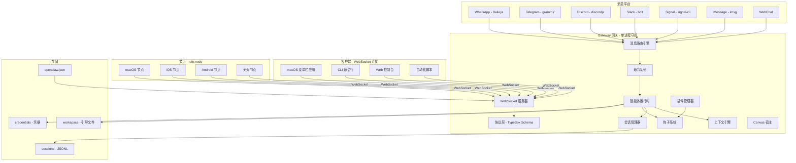
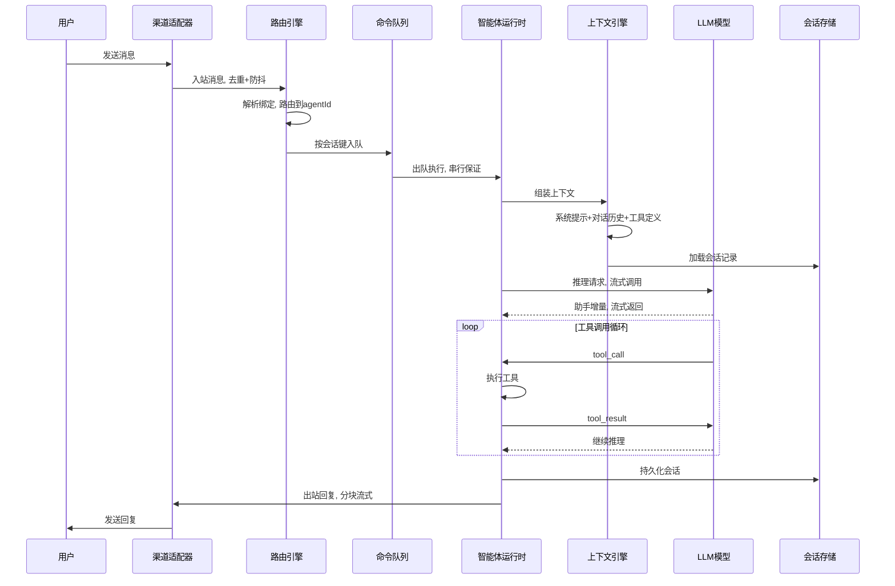
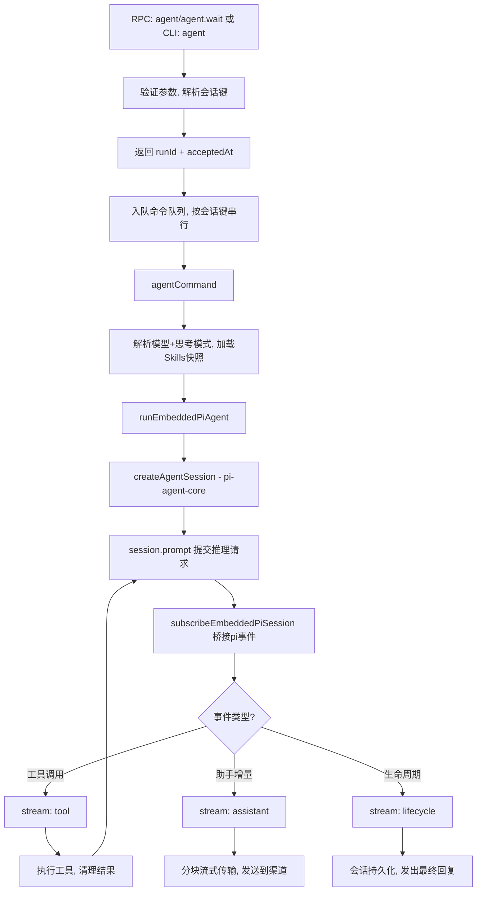
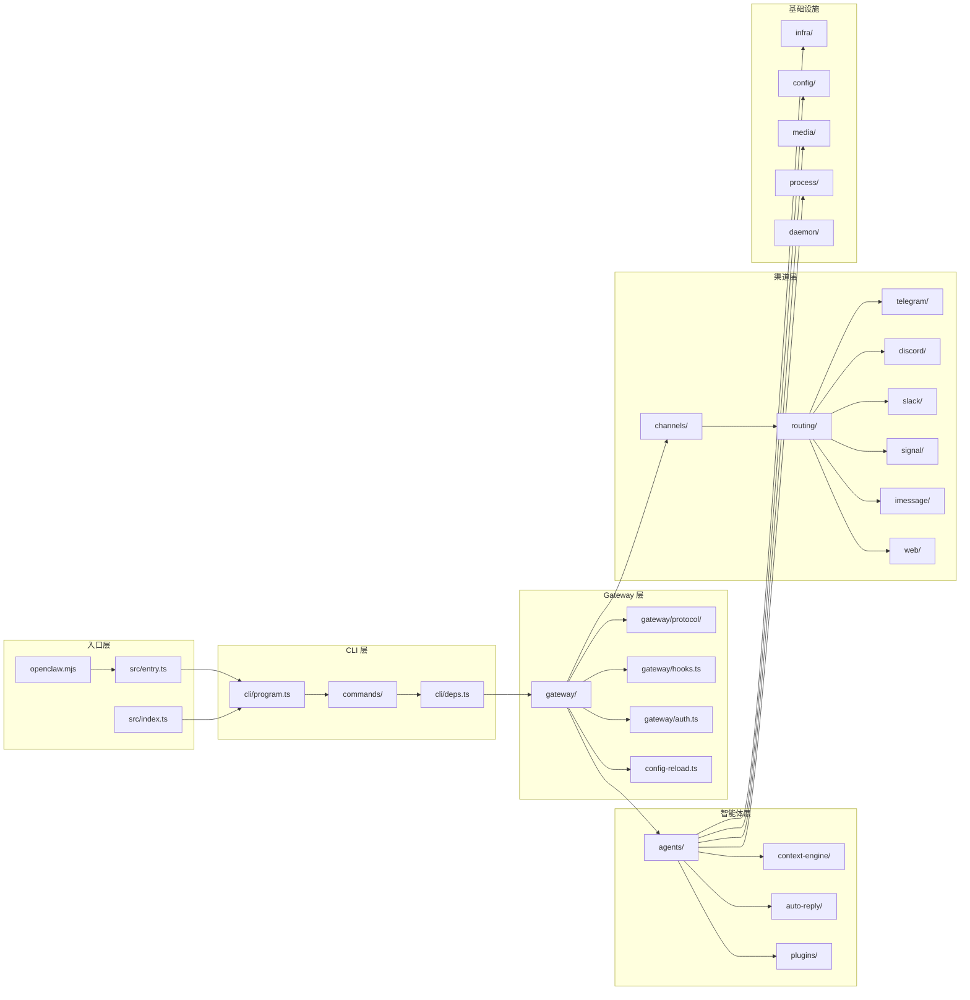
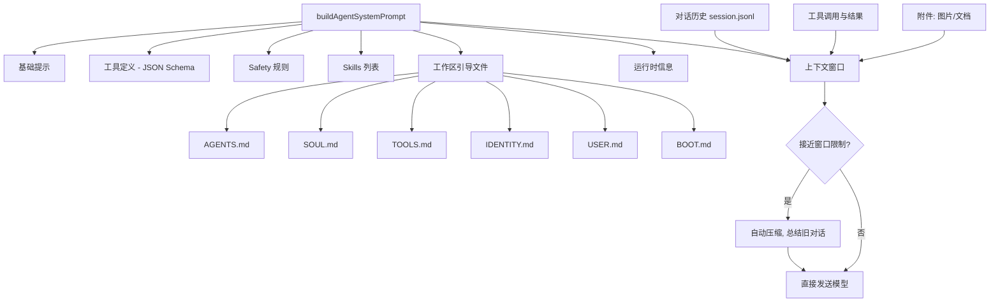

# OpenClaw 深度学习笔记

> 基于 `docs/zh-CN/` 全部约 310 个中文文档和 `src/` 源码结构的完整梳理。
> 按照「底层协议 → 核心架构 → 运行时引擎 → 应用层」的递进路径组织。

---

## 目录

- [一、项目概览](#一项目概览)
- [二、架构总图](#二架构总图)
- [三、学习路线图（七阶段）](#三学习路线图七阶段)
  - [第一阶段：基础概念与环境搭建](#第一阶段基础概念与环境搭建)
  - [第二阶段：Gateway 核心架构](#第二阶段gateway-核心架构)
  - [第三阶段：智能体运行时](#第三阶段智能体运行时)
  - [第四阶段：渠道与路由系统](#第四阶段渠道与路由系统)
  - [第五阶段：插件与扩展系统](#第五阶段插件与扩展系统)
  - [第六阶段：节点、媒体与应用层](#第六阶段节点媒体与应用层)
  - [第七阶段：自动化与高级主题](#第七阶段自动化与高级主题)
- [四、核心架构图解](#四核心架构图解)
- [五、源码导读](#五源码导读)
- [六、关键设计决策笔记](#六关键设计决策笔记)
- [七、学习检查清单](#七学习检查清单)

---

## 一、项目概览

**OpenClaw** 是一个多渠道 AI 智能体 Gateway（网关），核心设计理念：

| 维度 | 说明 |
|------|------|
| **定位** | 统一管理多个消息平台（WhatsApp、Telegram、Discord、Slack、Signal、iMessage 等）的 AI 智能体网关 |
| **架构** | 单 Gateway 守护进程 + 多客户端/节点 WebSocket 连接 |
| **运行时** | 基于 pi-agent-core 的嵌入式智能体引擎（非子进程） |
| **语言** | TypeScript（ESM），Node.js 22+ |
| **构建** | pnpm 工作区（monorepo），tsdown 构建 |
| **平台** | macOS 菜单栏应用、iOS/Android 节点、Web 控制台、CLI |

### 技术栈一览

```
核心依赖：
├── pi-agent-core / pi-ai / pi-coding-agent  -- 智能体运行时
├── @sinclair/typebox                         -- 协议 Schema 定义
├── hono / express / ws                       -- HTTP + WebSocket 服务
├── commander                                 -- CLI 框架
├── @whiskeysockets/baileys                   -- WhatsApp 协议
├── grammy                                    -- Telegram Bot API
├── @slack/bolt                               -- Slack 集成
├── @discordjs/voice                          -- Discord 集成
├── zod                                       -- 运行时校验
├── playwright-core                           -- 浏览器自动化
└── sharp / pdfjs-dist                        -- 媒体处理
```

---

## 二、架构总图

### 系统拓扑



### 消息生命周期



---

## 三、学习路线图（七阶段）

---

### 第一阶段：基础概念与环境搭建

**目标：** 理解 OpenClaw 是什么，搭建开发环境。

#### 阅读材料

| 文档 | 内容 |
|------|------|
| `docs/zh-CN/index.md` | 项目总览：多渠道 AI 智能体 Gateway |
| `docs/zh-CN/install/index.md` | 安装方式（安装器 / npm 全局 / 源码构建） |
| `docs/zh-CN/install/node.md` | Node.js 22+ 版本要求与 PATH 排错 |
| `docs/zh-CN/install/development-channels.md` | stable / beta / dev 三个发布渠道 |
| `docs/zh-CN/concepts/features.md` | 功能全景：渠道、路由、媒体、应用 |

#### 源码入口理解

**启动链路：**

```
用户执行 `openclaw` 命令
    ↓
openclaw.mjs          -- 检查 Node 22.12+ 版本，加载 dist/entry.js
    ↓
src/entry.ts          -- 设置进程标题、编译缓存、CLI profile
                         调用 runCli() → 解析命令参数
    ↓
src/index.ts          -- 库入口：加载 dotenv → 规范化环境 → 确保 PATH
                         启用控制台捕获 → 检查运行时 → buildProgram()
    ↓
src/cli/program.ts    -- Commander 定义所有子命令
```

#### 关键笔记

- OpenClaw 是**单进程架构**：一台主机只运行一个 Gateway 实例
- Gateway 是消息的**唯一数据源**，客户端通过 WebSocket 读取
- 启动流程先做版本检查和环境规范化，再加载 CLI 程序
- `src/index.ts` 既是库入口（导出 API），也是 CLI 入口（当作为主模块时执行 `program.parseAsync`）

---

### 第二阶段：Gateway 核心架构

**目标：** 深入理解 Gateway 的设计哲学、协议、生命周期。

#### 2.1 架构核心概念

| 文档 | 内容 |
|------|------|
| `docs/zh-CN/concepts/architecture.md` | Gateway 架构总览 |

**设计决策：**

- **单 Gateway 守护进程模型**：每台主机一个 Gateway，拥有所有消息平台连接
- **WebSocket + JSON 帧协议**：统一的通信方式，支持请求/响应和事件推送
- **两种角色**：操作员（operator，控制平面）和节点（node，能力宿主）
- **配对机制**：基于设备的信任模型，本地连接可自动批准

**连接生命周期：**

```
Client                    Gateway
  |                          |
  |---- req:connect -------->|    首帧必须是 connect
  |<------ res (hello-ok) ---|    携带快照：presence + health
  |                          |
  |<------ event:presence ---|    推送事件
  |<------ event:tick -------|
  |                          |
  |------- req:agent ------->|    发起智能体运行
  |<------ res:agent --------|    确认：{runId, status:"accepted"}
  |<------ event:agent ------|    流式传输
  |<------ res:agent --------|    最终结果
```

#### 2.2 Gateway 协议

| 文档 | 内容 |
|------|------|
| `docs/zh-CN/gateway/protocol.md` | WebSocket 协议详解 |
| `docs/zh-CN/concepts/typebox.md` | TypeBox 协议 Schema |

**协议帧格式：**

| 帧类型 | 格式 | 说明 |
|--------|------|------|
| Request | `{type:"req", id, method, params}` | 客户端发起请求 |
| Response | `{type:"res", id, ok, payload\|error}` | 服务端响应 |
| Event | `{type:"event", event, payload, seq?}` | 服务端推送事件 |

**关键设计：**

- **TypeBox 是协议的唯一事实来源**，从中生成 JSON Schema 和 Swift 模型
- 源码位置：`src/gateway/protocol/schema.ts`（定义）、`src/gateway/protocol/index.ts`（验证）
- 有副作用的方法需要**幂等键**以安全重试
- 认证：`OPENCLAW_GATEWAY_TOKEN` 或 `gateway.auth.token` / `gateway.auth.password`

#### 2.3 Gateway 运行与配置

| 文档 | 内容 |
|------|------|
| `docs/zh-CN/gateway/index.md` | 运行手册：启动、热重载、端口 |
| `docs/zh-CN/gateway/configuration.md` | `openclaw.json`（JSON5）配置文件 |
| `docs/zh-CN/gateway/gateway-lock.md` | 单例保护机制 |
| `docs/zh-CN/gateway/health.md` | 健康检查端点 |

**关键配置：**

```jsonc
// ~/.openclaw/openclaw.json (JSON5)
{
  "channels": {
    "telegram": { "allowFrom": ["*"] },
    "whatsapp": { "allowFrom": ["specific-number"] }
  },
  "agents": {
    "defaults": {
      "workspace": "~/.openclaw/workspace",
      "timeoutSeconds": 600
    },
    "list": [{ "id": "default", "model": "anthropic/claude-sonnet-4-20250514" }]
  },
  "gateway": {
    "port": 18789,
    "auth": { "token": "${OPENCLAW_GATEWAY_TOKEN}" },
    "reload": { "mode": "hybrid" }
  }
}
```

- 严格 Schema 校验：未知键或类型错误 → Gateway 拒绝启动
- 支持 `${VAR_NAME}` 环境变量替换
- 热重载模式：`hybrid`（默认）、`hot`、`restart`、`off`
- RPC 配置更新：`config.apply`、`config.patch`

#### 2.4 设备发现与网络

| 文档 | 内容 |
|------|------|
| `docs/zh-CN/gateway/discovery.md` | Bonjour/mDNS、Tailscale、手动发现 |
| `docs/zh-CN/network.md` | 网络层总览 |
| `docs/zh-CN/gateway/remote.md` | 远程访问（SSH 隧道、Tailscale） |

**发现机制优先级：**

```
直连端点 → Bonjour/mDNS (LAN) → Tailscale MagicDNS → SSH 回退
```

- Bonjour 服务类型：`_openclaw-gw._tcp`
- TXT 记录包含：`gatewayPort`、`gatewayTls`、`tailnetDns`

#### 2.5 安全与沙箱

| 文档 | 内容 |
|------|------|
| `docs/zh-CN/gateway/security/index.md` | 威胁模型与注意事项 |
| `docs/zh-CN/gateway/sandboxing.md` | Docker 沙箱隔离 |

**沙箱设计：**

| 模式 | 说明 |
|------|------|
| `off` | 不使用沙箱 |
| `non-main` | 仅非主会话在沙箱中运行 |
| `all` | 所有会话都在沙箱中运行 |

- 作用域：`session`（会话级）、`agent`（智能体级）、`shared`（共享）
- 工作区访问：`none` / `ro`（只读挂载） / `rw`（读写挂载）
- `tools.elevated` 列表中的工具可在主机上执行，绕过沙箱

---

### 第三阶段：智能体运行时

**目标：** 理解消息从接收到回复的完整链路。这是 OpenClaw 的核心中的核心。

#### 3.1 智能体循环

| 文档 | 内容 |
|------|------|
| `docs/zh-CN/concepts/agent-loop.md` | 完整的智能体循环生命周期 |

**智能体循环全流程：**



**关键函数调用链：**

```
agent RPC 入口
  └─ agentCommand()
       ├─ 解析模型 + 认证配置
       ├─ 加载 Skills 快照
       └─ runEmbeddedPiAgent()
            ├─ 队列串行化（按会话键）
            ├─ createAgentSession()    ← pi-agent-core SDK
            ├─ 构建系统提示
            ├─ session.prompt()        ← 提交推理
            └─ subscribeEmbeddedPiSession()
                 ├─ tool 事件 → stream:"tool"
                 ├─ assistant 增量 → stream:"assistant"
                 └─ lifecycle 事件 → stream:"lifecycle"
```

**钩子系统（两个层面）：**

| 类型 | 示例 | 说明 |
|------|------|------|
| 内部钩子 | `agent:bootstrap` | 系统提示最终确定前运行，可修改引导文件 |
| 内部钩子 | 命令钩子（`/new`、`/reset`） | 斜杠命令触发 |
| 插件钩子 | `before_agent_start` | 运行开始前注入上下文 |
| 插件钩子 | `agent_end` | 完成后检查最终消息 |
| 插件钩子 | `before_tool_call` / `after_tool_call` | 拦截工具参数/结果 |
| 插件钩子 | `message_received` / `message_sent` | 入站/出站消息 |
| 插件钩子 | `session_start` / `session_end` | 会话生命周期 |
| 插件钩子 | `gateway_start` / `gateway_stop` | Gateway 生命周期 |

#### 3.2 Pi 集成

| 文档 | 内容 |
|------|------|
| `docs/zh-CN/pi.md` | Pi 集成架构详解 |

**与 Pi 的关系：**

```
OpenClaw 不是 Pi 的子进程，而是直接导入 SDK：

import { createAgentSession } from "pi-agent-core"

四个核心包：
├── pi-agent-core    -- 智能体会话运行时
├── pi-ai            -- 模型抽象层
├── pi-coding-agent  -- 编码工具集
└── pi-tui           -- 终端 UI 组件
```

**OpenClaw 对 Pi 的定制：**

- 自定义工具注入（exec、message、browser、canvas 等渠道工具）
- 自定义系统提示（`buildAgentSystemPrompt()` 构建）
- 多认证配置文件（OAuth 令牌管理）
- 工具策略过滤和 Schema 规范化
- pi 扩展：`compaction-safeguard`、`context-pruning` 等

#### 3.3 消息流

| 文档 | 内容 |
|------|------|
| `docs/zh-CN/concepts/messages.md` | 消息流程、去重、防抖、队列模式 |

**入站消息处理：**

1. **去重**：按 channel/account/peer/session/messageId 短期缓存
2. **防抖**：同一发送者快速连续文本可合并；媒体/附件立即处理
3. **会话归属**：直接聊天合并到主会话键；群组/频道独立

**队列模式：**

| 模式 | 行为 |
|------|------|
| `interrupt` | 中断当前运行，立即处理新消息 |
| `steer` | 将新消息注入当前运行的上下文 |
| `followup` | 排队等待当前运行完成后执行 |
| `collect` | 收集多条消息后批量处理 |

#### 3.4 上下文引擎

| 文档 | 内容 |
|------|------|
| `docs/zh-CN/concepts/context.md` | 模型可见内容与构建方式 |
| `docs/zh-CN/concepts/system-prompt.md` | 系统提示的组装 |
| `docs/zh-CN/concepts/compaction.md` | 上下文窗口压缩 |
| `docs/zh-CN/concepts/session-pruning.md` | 工具结果修剪 |

**上下文组成：**

```
模型接收的上下文 =
  系统提示
    ├─ Tooling（工具定义）
    ├─ Safety（安全规则）
    ├─ Skills（技能列表，紧凑格式）
    ├─ Workspace（AGENTS.md / SOUL.md / TOOLS.md 等引导文件）
    ├─ Documentation（文档引用）
    ├─ Current Date & Time
    ├─ Heartbeats（心跳配置）
    ├─ Runtime（运行时信息）
    └─ Reasoning（推理配置）
  + 对话历史（会话记录）
  + 工具调用/结果
  + 附件（图片、文档等）
```

- 大文件按 `bootstrapMaxChars` 截断
- Skills 只注入紧凑列表（名称+描述+路径），模型按需加载 SKILL.md
- 源码位置：`src/context-engine/`

**压缩 vs 修剪：**

| 操作 | 压缩 (Compaction) | 修剪 (Pruning) |
|------|-------------------|----------------|
| 作用 | 总结较早对话为摘要 | 裁剪旧工具结果 |
| 持久化 | 是（写入 JSONL） | 否（仅在内存中） |
| 触发 | 接近上下文窗口限制时自动触发，或 `/compact` | 运行时按需 |

#### 3.5 会话与记忆

| 文档 | 内容 |
|------|------|
| `docs/zh-CN/concepts/session.md` | 会话管理 |
| `docs/zh-CN/concepts/memory.md` | 工作区记忆系统 |
| `docs/zh-CN/concepts/agent-workspace.md` | 工作区文件布局 |

**会话模型：**

```
会话键 = agent:<agentId>:<mainKey>

dmScope 模式：
├── main（默认）    -- 所有直接聊天合并到一个会话
├── per-peer        -- 每个对端独立会话
├── per-channel-peer -- 每个渠道+对端独立
└── per-account-channel-peer -- 最细粒度

存储位置：
~/.openclaw/agents/<agentId>/sessions/
  ├── sessions.json        -- 会话索引
  └── <SessionId>.jsonl     -- 会话记录
```

- 每日重置：默认凌晨 4:00
- `/new` 和 `/reset` 可手动重置

**记忆系统：**

```
工作区记忆文件：
├── MEMORY.md           -- 长期记忆（决策/偏好）
├── memory/YYYY-MM-DD.md -- 日常笔记
└── 向量搜索索引         -- memory_search / memory_get

特性：
├── 压缩前自动刷写（memoryFlush 配置）
├── 混合搜索：向量 + BM25 全文
├── 嵌入缓存：SQLite 缓存块嵌入
└── 远程嵌入：OpenAI/Gemini（可选本地 node-llama-cpp）
```

**工作区文件布局：**

```
~/.openclaw/workspace/          ← agents.defaults.workspace
├── AGENTS.md                   ← 智能体指令（首轮注入）
├── SOUL.md                     ← 人格/风格定义
├── USER.md                     ← 用户信息
├── IDENTITY.md                 ← 身份信息
├── TOOLS.md                    ← 工具使用指南
├── HEARTBEAT.md                ← 心跳消息模板
├── BOOT.md                     ← 启动消息
├── MEMORY.md                   ← 长期记忆
├── memory/                     ← 日常记忆
│   └── YYYY-MM-DD.md
├── skills/                     ← 自定义技能
│   └── <skill>/SKILL.md
└── canvas/                     ← Canvas 内容
```

#### 3.6 流式传输

| 文档 | 内容 |
|------|------|
| `docs/zh-CN/concepts/streaming.md` | 分块回复与 Telegram 草稿流 |

**两层流式传输：**

1. **分块流式传输**：`EmbeddedBlockChunker` 按 `minChars`/`maxChars` 分块
   - 断点偏好：段落 → 换行 → 句子
   - 不在代码围栏内拆分
   - `humanDelay`：块间随机暂停，使回复更自然

2. **Telegram 草稿流**：
   - `streamMode: "partial"` -- 逐 token 更新草稿
   - `streamMode: "block"` -- 分块更新草稿
   - `streamMode: "off"` -- 关闭

---

### 第四阶段：渠道与路由系统

**目标：** 理解多渠道消息接入和路由机制。

#### 4.1 渠道概览

| 文档 | 内容 |
|------|------|
| `docs/zh-CN/channels/index.md` | 支持的消息平台概览 |
| `docs/zh-CN/channels/channel-routing.md` | 各渠道路由规则 |

**内置渠道 vs 插件渠道：**

```
内置渠道（src/ 内）：
├── WhatsApp (src/web/)          -- Baileys 协议
├── Telegram (src/telegram/)     -- grammY Bot API
├── Discord (src/discord/)       -- discord.js
├── Slack (src/slack/)           -- @slack/bolt
├── Signal (src/signal/)         -- signal-cli JSON-RPC
├── iMessage (src/imessage/)     -- imsg stdio JSON-RPC
└── WebChat (src/channels/)      -- Gateway WS API

插件渠道（extensions/ 内）：
├── Matrix, MS Teams, LINE, 飞书, Google Chat
├── Mattermost, Nextcloud Talk, Nostr, Twitch
├── Tlon(Urbit), IRC, Zalo, BlueBubbles
└── Synology Chat
```

#### 4.2 核心渠道实现（建议选读 2-3 个）

**推荐阅读顺序：**

1. **Telegram**（`docs/zh-CN/channels/telegram.md` + `src/telegram/`）-- 最简单，基于 grammY
2. **Discord**（`docs/zh-CN/channels/discord.md` + `src/discord/`）-- 群组/服务器模型
3. **WhatsApp**（`docs/zh-CN/channels/whatsapp.md` + `src/web/`）-- Baileys，最复杂

#### 4.3 多智能体路由

| 文档 | 内容 |
|------|------|
| `docs/zh-CN/concepts/multi-agent.md` | 多智能体路由与隔离 |

**路由解析优先级（从高到低）：**

```
1. peer 精确匹配
2. guildId 匹配（Discord 服务器）
3. teamId 匹配（Slack 团队）
4. accountId 匹配
5. 渠道级默认
6. 全局默认智能体
```

**绑定规则：**

```jsonc
{
  "bindings": [
    {
      "channel": "telegram",
      "accountId": "bot-1",
      "peer": "user-123",
      "agentId": "agent-a"    // 最具体 → 最高优先级
    },
    {
      "channel": "whatsapp",
      "agentId": "agent-b"    // 渠道级默认
    }
  ]
}
```

#### 4.4 群组与配对

| 文档 | 内容 |
|------|------|
| `docs/zh-CN/channels/pairing.md` | 私信访问控制与节点加入 |
| `docs/zh-CN/channels/groups.md` | 跨平台群聊行为 |
| `docs/zh-CN/channels/group-messages.md` | mentionPatterns 与激活条件 |

---

### 第五阶段：插件与扩展系统

**目标：** 理解插件架构，具备编写插件的能力。

#### 阅读材料

| 文档 | 内容 |
|------|------|
| `docs/zh-CN/plugins/manifest.md` | 插件清单 (`openclaw.plugin.json`) |
| `docs/zh-CN/plugins/agent-tools.md` | 注册智能体工具 |

#### 插件结构

```
extensions/<plugin-name>/
├── openclaw.plugin.json    ← 插件清单（必需）
├── package.json            ← npm 包定义
├── src/
│   ├── index.ts            ← 入口，导出 activate()
│   └── channel.ts          ← 渠道实现（如果是渠道插件）
└── tsconfig.json
```

**清单文件（`openclaw.plugin.json`）：**

```jsonc
{
  "id": "my-plugin",            // 必填
  "configSchema": { ... },      // 必填，JSON Schema
  "kind": "channel",            // 可选
  "channels": [{ "id": "my-channel", "name": "My Channel" }],
  "providers": [],
  "skills": [],
  "name": "My Plugin",
  "description": "...",
  "version": "1.0.0"
}
```

**注册工具：**

```typescript
// 在插件 activate() 中
api.registerTool({
  name: "my_tool",
  description: "做某件事",
  inputSchema: { type: "object", properties: { ... } },
  optional: true,  // true = 需要在 tools.allow 中显式启用
  handler: async (params) => { /* ... */ }
});
```

#### 源码

- 插件加载与生命周期：`src/plugins/`
- 扩展 API：`src/extensionAPI.ts`
- 示例：`extensions/` 目录下任选一个插件阅读

---

### 第六阶段：节点、媒体与应用层

**目标：** 了解端侧能力和媒体处理。

#### 6.1 节点系统

| 文档 | 内容 |
|------|------|
| `docs/zh-CN/nodes/index.md` | 配对、能力声明、权限 |
| `docs/zh-CN/nodes/camera.md` | 相机捕获（iOS/macOS） |
| `docs/zh-CN/nodes/audio.md` | 音频转录与语音注入 |
| `docs/zh-CN/nodes/talk.md` | Talk 模式（ElevenLabs TTS 连续语音） |
| `docs/zh-CN/nodes/voicewake.md` | 语音唤醒 |

**节点能力模型：**

```
节点以 role:"node" 连接 → 声明能力：
├── canvas.*      -- Canvas 渲染
├── camera.*      -- 相机捕获（照片/短视频）
├── screen.record -- 屏幕录制
├── location.get  -- 位置获取
└── 自定义命令
```

#### 6.2 媒体管线

| 文档 | 内容 |
|------|------|
| `docs/zh-CN/nodes/images.md` | 图像和媒体支持 |
| `docs/zh-CN/nodes/media-understanding.md` | 媒体理解（图片/音频/视频） |

源码：`src/media/`

#### 6.3 Web UI

| 文档 | 内容 |
|------|------|
| `docs/zh-CN/web/index.md` | Web 控制台概述 |
| `docs/zh-CN/web/webchat.md` | WebChat 实现 |
| `docs/zh-CN/web/control-ui.md` | 控制 UI（聊天、节点、配置） |

源码：`ui/`

#### 6.4 原生应用

| 文档 | 内容 |
|------|------|
| `docs/zh-CN/platforms/macos.md` | macOS 菜单栏应用 + Gateway 代理 |
| `docs/zh-CN/platforms/ios.md` | iOS 节点（Canvas/Camera） |
| `docs/zh-CN/platforms/android.md` | Android 节点（Canvas/Chat/Camera） |

源码：`apps/macos/`、`apps/ios/`、`apps/android/`、`apps/shared/`（OpenClawKit）

---

### 第七阶段：自动化与高级主题

**目标：** 掌握生产环境运维和高级功能。

#### 阅读材料

| 文档 | 内容 |
|------|------|
| `docs/zh-CN/automation/cron-jobs.md` | 定时任务（Gateway 调度器） |
| `docs/zh-CN/automation/hooks.md` | Hooks 自动化（命令与生命周期事件） |
| `docs/zh-CN/automation/webhook.md` | Webhooks（唤醒与隔离智能体） |
| `docs/zh-CN/automation/auth-monitoring.md` | 认证监控（OAuth 过期） |
| `docs/zh-CN/concepts/oauth.md` | OAuth 令牌管理 |
| `docs/zh-CN/concepts/queue.md` | 命令队列深入 |
| `docs/zh-CN/concepts/retry.md` | 重试策略 |

**自动化三件套：**

```
Cron Jobs（定时任务）
├── Gateway 内置调度器
├── 支持唤醒消息和心跳
└── 配置在 openclaw.json 的 cron 字段

Hooks（钩子）
├── 命令钩子（/new、/reset、/stop 等）
├── 生命周期钩子（agent:bootstrap 等）
└── 可执行外部脚本

Webhooks
├── 外部系统触发智能体
├── Gmail PubSub 推送集成
└── 支持隔离智能体作用域
```

---

## 四、核心架构图解

### 源码模块关系图



### 智能体上下文构建过程



---

## 五、源码导读

### 推荐阅读顺序

| 阶段 | 文件/目录 | 重点关注 |
|------|-----------|----------|
| 1 | `openclaw.mjs` | Node 版本检查、编译缓存 |
| 2 | `src/entry.ts` | CLI profile、进程标题、`runCli()` |
| 3 | `src/index.ts` | dotenv/env 规范化、`buildProgram()` |
| 4 | `src/cli/program.ts` | Commander 命令注册 |
| 5 | `src/gateway/protocol/schema.ts` | TypeBox 协议定义（帧格式） |
| 6 | `src/gateway/protocol/index.ts` | 协议验证逻辑 |
| 7 | `src/gateway/boot.ts` | Gateway 启动流程 |
| 8 | `src/gateway/client.ts` | WebSocket 客户端连接管理 |
| 9 | `src/gateway/events.ts` | 事件分发 |
| 10 | `src/agents/` (入口文件) | 智能体运行时核心 |
| 11 | `src/context-engine/` | 上下文组装 |
| 12 | `src/auto-reply/reply.ts` | 回复管线 |
| 13 | `src/channels/` | 渠道抽象层 |
| 14 | `src/routing/` | 消息路由引擎 |
| 15 | `src/plugins/` | 插件加载与生命周期 |
| 16 | `src/extensionAPI.ts` | 扩展 API 定义 |

### 关键目录说明

```
src/
├── acp/              -- Agent Control Protocol（ACP 协议）
├── agents/           -- 智能体运行时：认证、工具、执行、会话
│   ├── auth-profiles/  -- 多认证配置文件管理
│   ├── bash-tools.*    -- Bash 工具执行
│   ├── cli-runner.*    -- CLI 运行器
│   └── compaction.*    -- 上下文压缩
├── auto-reply/       -- 回复管线：分块、模板、模型调用
├── browser/          -- 浏览器自动化（CDP、Chrome MCP）
├── canvas-host/      -- Canvas/A2UI 宿主服务
├── channels/         -- 渠道抽象：传输、线程绑定
├── cli/              -- CLI：命令定义、提示、依赖注入
├── config/           -- 配置加载（openclaw.json）
├── context-engine/   -- 上下文组装引擎
├── cron/             -- 定时任务、Webhooks、会话清理
├── daemon/           -- 服务管理（systemd/launchd/schtasks）
├── discord/          -- Discord 渠道实现
├── gateway/          -- Gateway 核心：WS 服务器、协议、钩子
│   ├── protocol/       -- TypeBox Schema 定义
│   ├── boot.ts         -- 启动流程
│   ├── client.ts       -- 连接管理
│   └── hooks.ts        -- 钩子系统
├── hooks/            -- 内部钩子（agent:bootstrap 等）
├── imessage/         -- iMessage 渠道
├── infra/            -- 基础设施：二进制、端口、运行时
├── line/             -- LINE 渠道
├── link-understanding/ -- 链接检测与处理
├── media/            -- 媒体管线（图像/音频/视频）
├── plugins/          -- 插件加载与生命周期管理
├── process/          -- 进程执行、子进程桥接
├── provider-web/     -- Web 提供商
├── routing/          -- 消息路由引擎
├── signal/           -- Signal 渠道
├── slack/            -- Slack 渠道
├── telegram/         -- Telegram 渠道
├── terminal/         -- 终端 UI（表格、调色板）
├── types/            -- 共享类型定义
├── utils/            -- 通用工具函数
├── web/              -- WhatsApp Web 渠道（Baileys）
└── wizard/           -- 新手引导向导
```

---

## 六、关键设计决策笔记

### 1. 为什么是单 Gateway 架构？

- WhatsApp (Baileys) 要求**单会话连接**，多实例会导致冲突
- 单进程简化了状态管理和会话一致性
- 通过 WebSocket 协议支持多客户端并发控制

### 2. 为什么嵌入 Pi SDK 而非子进程？

- 避免 IPC 开销和序列化成本
- 共享内存空间，直接访问工具和上下文
- 更精细的事件桥接和流式控制
- OpenClaw 定制了系统提示、工具集和认证配置

### 3. TypeBox 作为协议事实来源

- 运行时类型检查 + 编译时 TypeScript 类型
- 从 TypeBox Schema 生成 JSON Schema（用于验证）和 Swift 模型（用于 iOS/macOS）
- 确保协议定义的一致性

### 4. 会话级队列串行化

- 避免同一会话的多个智能体运行并发
- 防止工具执行和会话状态竞争
- 队列模式（steer/followup/collect）提供灵活的并发策略

### 5. 工作区文件作为记忆载体

- 使用 Markdown 文件（而非数据库）存储记忆
- 易于人工检查和编辑
- Git 版本控制支持
- 向量搜索提供语义检索能力

### 6. 插件化渠道架构

- 核心渠道（WhatsApp、Telegram 等）内置于 `src/`
- 社区渠道作为 `extensions/` 插件
- 统一的插件清单（`openclaw.plugin.json`）和扩展 API
- 运行时依赖必须在 `dependencies` 中（npm install --omit=dev）

### 7. 分块流式传输设计

- 不是逐 token 发送（对消息平台不友好）
- 而是按语义断点分块发送（段落 → 换行 → 句子）
- 不在代码围栏内拆分
- `humanDelay` 模拟人类打字节奏

---

## 七、学习检查清单

完成每个阶段后，用 `[x]` 标记已完成的项目：

### 第一阶段：基础

- [ ] 理解 OpenClaw 的定位（多渠道 AI 智能体 Gateway）
- [ ] 成功搭建开发环境（`pnpm install` + `pnpm build`）
- [ ] 跟踪了启动链路：`openclaw.mjs` → `entry.ts` → `index.ts` → `program.ts`
- [ ] 阅读了 `docs/zh-CN/index.md` 和 `docs/zh-CN/concepts/features.md`

### 第二阶段：Gateway 架构

- [ ] 理解单 Gateway 守护进程模型
- [ ] 理解 WebSocket + JSON 帧协议（Request/Response/Event）
- [ ] 理解连接生命周期（connect → hello-ok → 事件流）
- [ ] 了解 TypeBox 作为协议事实来源的设计
- [ ] 阅读了 `src/gateway/protocol/schema.ts`
- [ ] 理解配置文件格式（`openclaw.json`，JSON5）
- [ ] 理解设备发现机制（Bonjour → Tailscale → SSH）
- [ ] 理解沙箱隔离模型（off/non-main/all）

### 第三阶段：智能体运行时

- [ ] 理解智能体循环全流程（RPC → 队列 → Pi Agent → 流式回复）
- [ ] 理解 Pi SDK 的嵌入式调用方式
- [ ] 理解消息流（去重 → 防抖 → 路由 → 队列 → 执行 → 回复）
- [ ] 理解上下文引擎和系统提示的组装方式
- [ ] 理解压缩（compaction）和修剪（pruning）的区别
- [ ] 理解会话管理（dmScope、每日重置、JSONL 存储）
- [ ] 理解记忆系统（Markdown 文件 + 向量搜索）
- [ ] 理解分块流式传输的设计
- [ ] 理解钩子系统（内部钩子 + 插件钩子）

### 第四阶段：渠道与路由

- [ ] 理解内置渠道 vs 插件渠道的区分
- [ ] 阅读了至少 2 个渠道实现的源码
- [ ] 理解多智能体路由的优先级规则
- [ ] 理解配对机制和群组行为

### 第五阶段：插件系统

- [ ] 理解插件清单格式（`openclaw.plugin.json`）
- [ ] 理解工具注册 API（`api.registerTool()`）
- [ ] 阅读了至少 1 个 `extensions/` 下的插件源码
- [ ] 理解 `src/plugins/` 的加载与生命周期管理

### 第六阶段：节点与应用

- [ ] 理解节点能力模型（caps/commands/permissions）
- [ ] 了解媒体管线（图像/音频/视频处理）
- [ ] 了解 Web 控制台和 WebChat 的实现
- [ ] 了解原生应用（macOS/iOS/Android）的架构

### 第七阶段：自动化

- [ ] 理解 Cron Jobs、Hooks、Webhooks 三种自动化方式
- [ ] 理解 OAuth 令牌管理
- [ ] 理解命令队列的高级配置
- [ ] 理解重试策略

---

## 附录：文档索引快速参考

### 核心概念文档（docs/zh-CN/concepts/）

| 文档 | 主题 |
|------|------|
| `architecture.md` | Gateway 网关架构 |
| `agent-loop.md` | 智能体循环生命周期 |
| `agent.md` | 智能体运行时 |
| `agent-workspace.md` | 工作区布局 |
| `messages.md` | 消息流程与队列 |
| `context.md` | 上下文构建 |
| `system-prompt.md` | 系统提示组装 |
| `session.md` | 会话管理 |
| `memory.md` | 记忆系统 |
| `streaming.md` | 流式传输 |
| `compaction.md` | 上下文压缩 |
| `multi-agent.md` | 多智能体路由 |
| `queue.md` | 命令队列 |
| `typebox.md` | TypeBox 协议 |
| `oauth.md` | OAuth 令牌管理 |
| `retry.md` | 重试策略 |
| `features.md` | 功能全景 |

### Gateway 文档（docs/zh-CN/gateway/）

| 文档 | 主题 |
|------|------|
| `index.md` | 运行手册 |
| `protocol.md` | WebSocket 协议 |
| `configuration.md` | 配置文件 |
| `discovery.md` | 设备发现 |
| `sandboxing.md` | 沙箱隔离 |
| `security/index.md` | 安全模型 |
| `health.md` | 健康检查 |
| `gateway-lock.md` | 单例保护 |
| `remote.md` | 远程访问 |

### 渠道文档（docs/zh-CN/channels/）

| 文档 | 主题 |
|------|------|
| `index.md` | 渠道概览 |
| `channel-routing.md` | 路由规则 |
| `telegram.md` | Telegram |
| `discord.md` | Discord |
| `whatsapp.md` | WhatsApp |
| `slack.md` | Slack |
| `signal.md` | Signal |
| `imessage.md` | iMessage |
| `pairing.md` | 配对 |
| `groups.md` | 群组 |

### CLI 文档（docs/zh-CN/cli/）

| 文档 | 主题 |
|------|------|
| `index.md` | CLI 参考总览 |
| `gateway.md` | gateway 子命令 |
| `agent.md` | agent 子命令 |
| `config.md` | config 子命令 |
| `status.md` | status 子命令 |
| `onboard.md` | 新手引导 |
