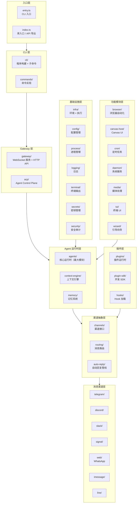
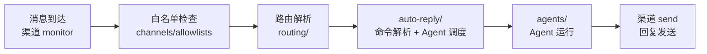
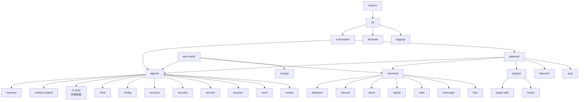

# OpenClaw 项目源码结构全解析

> 深入剖析 OpenClaw `src/` 目录下约 5,000+ TypeScript 文件的组织架构，
> 理解每个模块的职责边界、依赖关系和设计意图。

---

## 目录

- [一、总体架构分层](#一总体架构分层)
- [二、入口文件](#二入口文件)
- [三、Agent 核心 (agents/)](#三agent-核心-agents)
- [四、Gateway 服务 (gateway/)](#四gateway-服务-gateway)
- [五、CLI 与命令系统 (cli/ + commands/)](#五cli-与命令系统-cli--commands)
- [六、消息渠道层](#六消息渠道层)
- [七、渠道抽象与路由 (channels/ + routing/ + auto-reply/)](#七渠道抽象与路由-channels--routing--auto-reply)
- [八、插件系统 (plugins/ + plugin-sdk/ + hooks/)](#八插件系统-plugins--plugin-sdk--hooks)
- [九、记忆与上下文 (memory/ + context-engine/)](#九记忆与上下文-memory--context-engine)
- [十、基础设施层](#十基础设施层)
- [十一、功能模块](#十一功能模块)
- [十二、辅助模块](#十二辅助模块)
- [十三、模块依赖关系图](#十三模块依赖关系图)
- [十四、Swabble 语音唤醒守护进程](#十四swabble-语音唤醒守护进程)
- [十五、extensions 插件目录](#十五extensions-插件目录)
- [十六、apps 原生应用](#十六apps-原生应用)
- [附录：模块规模排行](#附录模块规模排行)

---

## 一、总体架构分层

OpenClaw 的 `src/` 采用 **分层 + 领域驱动** 的组织方式，从上到下依次为：



---

## 二、入口文件

### `entry.ts` — CLI 启动入口

```typescript
// 职责链：
// 1. Node.js 版本检查（MIN_NODE_MAJOR = 22）
// 2. Windows argv 规范化
// 3. --profile / --dev 环境变量注入
// 4. ExperimentalWarning 静默过滤
// 5. respawn 策略（必要时重新启动子进程）
// 6. 快速路径：--version / --help 直接响应
// 7. 调用 runCli() 进入主流程
```

### `index.ts` — 库入口 / API 导出

```typescript
// 导出编程 API，供外部 SDK 调用：
export {
  loadConfig,           // 配置加载
  getReplyFromConfig,   // 自动回复
  applyTemplate,        // 模板引擎
  createDefaultDeps,    // CLI 依赖注入
  monitorWebChannel,    // WhatsApp Web 监控
  ensureBinary,         // 二进制工具管理
  // ... 更多
};
```

### `extensionAPI.ts` — 插件 SDK 入口

供 `extensions/` 目录下的插件包导入使用的统一 API 接口。

---

## 三、Agent 核心 (agents/)

**这是整个项目最庞大的模块**，包含约 866 个 .ts 文件，承载了 Agent 运行时的全部逻辑。

### 3.1 目录结构

```
agents/
├── pi-embedded-runner/       # Pi-mono 嵌入运行器（核心）
│   ├── run.ts               #   runEmbeddedPiAgent 主入口
│   ├── run/                 #   attempt.ts / params.ts / payloads.ts
│   ├── system-prompt.ts     #   System Prompt 构建
│   ├── extensions.ts        #   扩展工厂
│   ├── compact.ts           #   压缩协调
│   ├── model.ts             #   模型解析
│   ├── session-manager-*.ts #   SessionManager 管理
│   ├── tool-split.ts        #   工具分割
│   ├── tool-result-*.ts     #   工具结果截断/预算
│   └── lanes.ts             #   队列 Lane 管理
│
├── pi-embedded-helpers/      # 嵌入辅助
│   ├── bootstrap.ts         #   Bootstrap 文件加载与截断
│   ├── turns.ts             #   Turn 验证与修复
│   ├── images.ts            #   图片处理
│   └── openai.ts            #   OpenAI 特殊处理
│
├── pi-extensions/            # Pi 扩展
│   ├── compaction-safeguard.ts  #   增强压缩
│   └── context-pruning/        #   上下文裁剪
│       ├── extension.ts
│       ├── pruner.ts
│       ├── settings.ts
│       └── tools.ts
│
├── tools/                    # Agent 工具实现
│   ├── memory-tool.ts       #   memory_search / memory_get
│   ├── browser-tool.*.ts    #   浏览器工具
│   ├── nodes-tool.ts        #   节点管理工具
│   ├── discord-actions*.ts  #   Discord 操作
│   ├── telegram-actions.ts  #   Telegram 操作
│   ├── slack-actions.ts     #   Slack 操作
│   └── common.ts            #   工具通用辅助
│
├── auth-profiles/            # 多 Auth Profile
│   ├── store.ts             #   Profile 存储
│   └── oauth.ts             #   OAuth 流程
│
├── skills/                   # Skills 系统
│   ├── workspace.ts         #   工作区 Skills 加载
│   ├── config.ts            #   Skill 配置解析
│   └── types.ts             #   类型定义
│
├── sandbox/                  # 沙箱环境（Docker）
├── cli-runner/               # CLI 交互模式运行器
│
├── system-prompt.ts          # buildAgentSystemPrompt 核心
├── pi-tools.ts               # createOpenClawCodingTools 工具装配
├── pi-tool-definition-adapter.ts  # AgentTool -> ToolDefinition 适配
├── tool-catalog.ts           # 工具目录与 Profile
├── tool-policy.ts            # Owner-only 策略
├── tool-policy-pipeline.ts   # 策略管线
├── pi-tools.policy.ts        # 策略解析
├── pi-tools.before-tool-call.ts   # 前置 Hook + 循环检测
├── compaction.ts             # 压缩核心算法
├── agent-scope.ts            # Agent 作用域解析
├── workspace.ts              # Bootstrap 文件加载
├── bootstrap-files.ts        # Bootstrap 过滤与解析
├── pi-embedded-subscribe.ts  # Pi 事件订阅
└── pi-project-settings.ts    # Settings 策略控制
```

### 3.2 职责总结

| 子模块 | 核心职责 |
|--------|----------|
| `pi-embedded-runner/` | Agent 运行的完整生命周期管理 |
| `pi-embedded-helpers/` | Bootstrap、Turn、图片等辅助处理 |
| `pi-extensions/` | 压缩增强和上下文裁剪扩展 |
| `tools/` | 30+ Agent 可用工具的实现 |
| `auth-profiles/` | 多凭证管理和 OAuth |
| `skills/` | 技能加载和工作区管理 |
| 根级 `*.ts` | System Prompt、工具管线、压缩、策略等核心逻辑 |

---

## 四、Gateway 服务 (gateway/)

约 365 个 .ts 文件，是 OpenClaw 的核心守护进程。

```
gateway/
├── protocol/                 # WebSocket 协议
│   ├── schema.ts            #   TypeBox Schema 总入口
│   ├── schema/              #   分领域 Schema 定义
│   │   ├── frames.ts        #     帧结构
│   │   ├── agent.ts         #     Agent 方法
│   │   ├── channels.ts      #     渠道方法
│   │   ├── config.ts        #     配置方法
│   │   ├── devices.ts       #     设备方法
│   │   └── ...
│   └── index.ts             #   AJV 运行时校验
│
├── server-methods/           # RPC 方法处理器
│   ├── chat.ts              #   agent / agent.wait 处理
│   ├── channels.ts          #   渠道管理
│   ├── config.ts            #   配置操作
│   ├── devices.ts           #   设备配对
│   └── ...
│
├── server/                   # HTTP API 服务
│   ├── openai-compat.ts     #   OpenAI Chat Completions 兼容
│   ├── open-responses.ts    #   OpenResponses API
│   └── tools-invoke.ts      #   Tools Invoke API
│
├── auth.ts                   # 认证模式（token/password/trusted-proxy）
├── device-auth.ts            # 设备身份与密钥
├── client.ts                 # WebSocket 客户端管理
├── server.impl.ts            # 服务器实现
├── server-methods.ts         # RPC 方法注册表
├── node-registry.ts          # 节点注册
├── config-reload.ts          # 配置热重载
├── probe.ts                  # 健康探针
├── control-ui.ts             # Web 控制面板
├── boot.ts                   # BOOT.md 启动引导
└── net.ts                    # 网络工具
```

---

## 五、CLI 与命令系统 (cli/ + commands/)

### cli/（292 文件）— 程序框架

```
cli/
├── program/                  # Commander.js 程序构建
│   ├── build-program.ts     #   构建程序实例
│   ├── command-registry.ts  #   核心命令懒注册
│   ├── register.subclis.ts  #   子 CLI 懒注册
│   ├── preaction.ts         #   preAction Hook
│   ├── action-reparse.ts    #   命令参数重解析
│   └── config-guard.ts      #   配置校验守卫
│
├── gateway-cli/              # openclaw gateway 子命令
├── daemon-cli/               # openclaw daemon 服务管理
├── cron-cli/                 # openclaw cron 定时任务
├── nodes-cli/                # openclaw nodes 节点管理
├── update-cli/               # openclaw update 自更新
├── browser-cli-actions-input/ # 浏览器 CLI 交互
│
├── run-main.ts               # runCli() 主运行函数
├── route.ts                  # 快速路由（health/status/config get）
├── profile.ts                # --profile / --dev 隔离
├── deps.ts                   # 延迟加载依赖注入
├── argv.ts                   # 参数解析工具
├── banner.ts                 # CLI Banner 显示
└── progress.ts               # 进度条与 Spinner
```

### commands/（373 文件）— 命令实现

```
commands/
├── agent.ts                  # openclaw agent 命令
├── agent/                    # Agent 子命令
│   └── delivery.ts          #   消息投递
├── channels/                 # openclaw channels 命令族
├── onboarding/               # 交互式引导
├── onboard-non-interactive/  # 非交互式引导
├── models/                   # openclaw models 命令
│   ├── list.ts              #   模型列表
│   └── list.registry.ts     #   注册表查询
├── status-all/               # openclaw status --all
├── gateway-status/           # Gateway 状态检查
├── doctor.ts                 # openclaw doctor 诊断
├── setup.ts                  # openclaw setup 初始化
├── config.ts                 # openclaw config 管理
├── login.ts                  # openclaw login 登录
└── send.ts                   # openclaw send 发送消息
```

---

## 六、消息渠道层

每个渠道模块遵循统一的内部结构模式：

```
<channel>/
├── monitor.ts      # 消息监听（轮询/WebSocket/Webhook）
├── send.ts         # 消息发送
├── accounts.ts     # 账号管理
├── types.ts        # 类型定义
├── runtime.ts      # 运行时注册（插件渠道）
├── onboarding.ts   # 渠道引导配置
├── probe.ts        # 健康探针
└── normalize.ts    # 消息格式规范化
```

### 各渠道概览

| 目录 | 渠道 | 文件数 | 特点 |
|------|------|--------|------|
| `telegram/` | Telegram | 141 | `bot/` 子目录、Reaction、Topic 支持 |
| `discord/` | Discord | 175 | `monitor/` + `voice/` 语音支持 |
| `slack/` | Slack | 126 | `http/` HTTP API、Block Kit、Threading |
| `signal/` | Signal | 32 | `monitor/` 子目录、端到端加密 |
| `web/` | WhatsApp Web | 77 | `auto-reply/` + `inbound/`、QR 登录 |
| `imessage/` | iMessage | 33 | `monitor/` 子目录、macOS 专属 |
| `line/` | LINE | 48 | `flex-templates/` Flex Message 模板 |
| `whatsapp/` | WhatsApp 通用 | 4 | E.164 规范化、JID 转换 |

---

## 七、渠道抽象与路由 (channels/ + routing/ + auto-reply/)

### channels/（175 文件）

```
channels/
├── allowlists/       # 白名单管理（谁可以发消息）
├── plugins/          # 插件渠道注册与管理
│   ├── types.core.ts #   核心渠道类型
│   ├── message-actions.ts  # 消息操作
│   └── actions/      #   渠道特定操作
├── web/              # Web 渠道辅助
└── transport/        # 传输层抽象
```

### routing/（11 文件）

```
routing/
├── session-keys.ts   # 会话键生成规则
├── account-lookup.ts # 账号查找
└── bindings.ts       # Agent 绑定路由
```

### auto-reply/（288 文件）

```
auto-reply/
├── reply/            # 回复管线核心
│   ├── agent-runner-memory.ts  # Agent 运行器
│   ├── commands-*.ts           # 斜杠命令处理
│   └── session-fork.ts         # 会话分叉
└── test-helpers/     # 测试辅助
```

**消息处理流程**：



---

## 八、插件系统 (plugins/ + plugin-sdk/ + hooks/)

### plugins/（95 文件）

```
plugins/
├── runtime/          # 插件运行时
├── discovery.ts      # 插件发现（扫描 extensions/）
├── install.ts        # npm install --omit=dev
├── loader.ts         # 加载插件模块
├── hooks.ts          # createHookRunner
├── hook-runner-global.ts  # 全局 Hook Runner
└── test-helpers/     # 测试辅助
```

### plugin-sdk/（111 文件）

```
plugin-sdk/
├── channel-helpers.ts    # 渠道开发辅助
├── webhooks.ts           # Webhook 注册
├── slack-message-actions.ts  # Slack 消息操作
└── runtime.ts            # 运行时 API
```

### hooks/（43 文件）

```
hooks/
├── loader.ts         # Hook 文件加载
├── bundled/          # 内置 Hook
│   └── gmail-watcher.ts  # Gmail 监听器
└── ...
```

---

## 九、记忆与上下文 (memory/ + context-engine/)

### memory/（103 文件）

```
memory/
├── manager.ts            # MemoryManager 核心
├── search-manager.ts     # 搜索管理器
├── manager-search.ts     # 向量 + 关键词检索
├── hybrid.ts             # 混合检索合并（BM25 + 向量）
├── mmr.ts                # 最大边际相关性去重
├── temporal-decay.ts     # 时间衰减排序
├── sqlite-vec.ts         # SQLite + vec 向量扩展
│
├── embeddings.ts         # 嵌入向量计算入口
├── embeddings-openai.ts  # OpenAI 嵌入
├── embeddings-gemini.ts  # Gemini 嵌入
├── embeddings-voyage.ts  # Voyage 嵌入
├── embeddings-mistral.ts # Mistral 嵌入
├── embeddings-ollama.ts  # Ollama 本地嵌入
│
├── batch-runner.ts       # 批量嵌入运行器
├── batch-openai.ts       # OpenAI 批量
├── batch-gemini.ts       # Gemini 批量
│
├── qmd-manager.ts        # QMD 后端管理
├── qmd-process.ts        # QMD 处理
├── qmd-scope.ts          # QMD 作用域
├── qmd-query-parser.ts   # 查询解析
│
├── session-files.ts      # 会话文件管理
├── backend-config.ts     # 后端配置
└── query-expansion.ts    # 查询扩展
```

### context-engine/（6 文件）

```
context-engine/
├── types.ts      # ContextEngine 接口定义
├── registry.ts   # 引擎注册与解析
├── legacy.ts     # LegacyContextEngine 实现
├── init.ts       # 初始化
└── index.ts      # 入口导出
```

---

## 十、基础设施层

### infra/（484 文件 — 第二大模块）

```
infra/
├── binaries.ts       # 外部二进制管理（ffmpeg 等）
├── env.ts            # 环境变量规范化
├── dotenv.ts         # .env 加载
├── ports.ts          # 端口检查与冲突处理
├── runtime-guard.ts  # 运行时断言（Node 版本）
├── path-env.ts       # PATH 环境保证
├── errors.ts         # 错误格式化
├── is-main.ts        # 主模块检测
├── openclaw-exec-env.ts  # 执行环境
├── warning-filter.ts     # 警告过滤
│
├── outbound/         # 出站消息服务
│   ├── outbound-send-service.ts
│   ├── message-action-runner.ts
│   └── tool-payload.ts
│
├── ...               # 设备配对、备份、网络工具等
```

### config/（236 文件）

```
config/
├── config.ts         # openclaw.json 加载与校验
├── sessions/         # 会话配置
│   ├── types.ts      #   会话类型定义
│   └── transcript.ts #   会话转录
├── ...               # Schema、迁移、绑定
```

### 其他基础设施

| 目录 | 文件数 | 核心职责 |
|------|--------|----------|
| `process/` | 28 | Shell 执行 (`exec`)、子进程桥接、Supervisor 进程守护 |
| `logging/` | 29 | 结构化日志、Console 捕获、敏感信息脱敏 |
| `terminal/` | 19 | ANSI 颜色、表格渲染、调色板 (`palette.ts`)、进度条 |
| `secrets/` | 50 | 密钥引用解析 (`env:` / `op:` / `file:`)、审计、运行时配置 |
| `security/` | 29 | 危险工具检测、DM 策略、安全正则、审计日志 |

---

## 十一、功能模块

| 目录 | 文件数 | 核心职责 |
|------|--------|----------|
| `browser/` | 168 | 浏览器自动化：CDP 协议控制、Playwright、Chrome 扩展、Control Server、路由 (`routes/`) |
| `canvas-host/` | 5 | Canvas/A2UI 宿主服务器：提供 `index.html` 和文件解析 |
| `cron/` | 109 | 定时任务：调度引擎、隔离 Agent 执行 (`isolated-agent/`)、投递服务 (`service/`) |
| `daemon/` | 54 | 系统服务管理：launchd (macOS)、systemd (Linux)、schtasks (Windows) |
| `media/` | 41 | 媒体处理：音频转码、FFmpeg 操作、图片处理、媒体存储 |
| `tui/` | 45 | 终端 UI：Gateway 聊天界面、组件 (`components/`)、主题 (`theme/`) |
| `wizard/` | 16 | 首次使用引导向导：交互式提示、会话初始化、完成确认 |
| `acp/` | 56 | Agent Control Plane：多 Agent 控制面、会话管理、绑定翻译器 |

---

## 十二、辅助模块

| 目录 | 文件数 | 核心职责 |
|------|--------|----------|
| `utils/` | 29 | 通用工具：分块 (chunking)、投递上下文、Provider 工具 |
| `types/` | 9 | 第三方库类型声明：qrcode-terminal、napi-rs-canvas 等 |
| `test-utils/` | 35 | 测试辅助：Fixtures、Mocks、临时目录管理 |
| `compat/` | 1 | 旧版名称兼容映射 |
| `docs/` | 1 | 文档相关测试（斜杠命令文档） |

---

## 十三、模块依赖关系图



---

## 十四、Swabble 语音唤醒守护进程

`Swabble/` 是仓库根目录下的一个 **独立 Swift 包**（非 `src/` 的一部分），但与 OpenClaw 紧密集成：

```
Swabble/
├── Sources/
│   ├── swabble/              # CLI 入口（Commander 框架）
│   │   ├── main.swift
│   │   └── Commands/         # serve / transcribe / doctor 等
│   ├── SwabbleCore/          # 核心库
│   │   ├── Config/           #   配置管理
│   │   ├── Hooks/            #   Hook 执行器
│   │   └── Support/          #   转录存储
│   └── SwabbleKit/           # 跨平台唤醒词门控工具
├── Tests/
├── Package.swift             # Swift Package Manager
└── docs/spec.md              # 设计规范
```

**作用**：macOS 语音唤醒守护进程，使用 Apple Speech.framework 本地模型持续监听麦克风，检测到唤醒词 "clawd" 后将转录文本通过 Shell Hook 传递给 OpenClaw Agent。

**工作流**：
```
麦克风 → AVAudioEngine → Speech.framework → 唤醒词检测 → Hook → openclaw agent --message "${text}"
```

---

## 十五、extensions 插件目录

`extensions/` 是仓库根目录下的插件包集合，每个是独立的 npm workspace 包：

| 插件 | 渠道/功能 |
|------|----------|
| `extensions/msteams/` | Microsoft Teams |
| `extensions/matrix/` | Matrix 协议 |
| `extensions/zalo/` | Zalo OA |
| `extensions/zalouser/` | Zalo 个人账号 |
| `extensions/irc/` | IRC 协议 |
| `extensions/bluebubbles/` | BlueBubbles (iMessage 代理) |
| `extensions/mattermost/` | Mattermost |
| `extensions/synology-chat/` | Synology Chat |
| `extensions/voice-call/` | 语音通话 |
| `extensions/acpx/` | ACP 扩展 |

每个插件遵循统一结构：`src/runtime.ts`（运行时注册）、`src/channel.ts`（渠道实现）、`src/monitor.ts`（消息监听）、`src/send.ts`（消息发送）。

---

## 十六、apps 原生应用

`apps/` 包含原生客户端应用：

| 目录 | 平台 | 技术栈 |
|------|------|--------|
| `apps/macos/` | macOS 菜单栏应用 | SwiftUI + Sparkle 自更新 |
| `apps/ios/` | iOS 客户端 | SwiftUI |
| `apps/android/` | Android 客户端 | Kotlin |

macOS 应用是 Gateway 的宿主进程（menubar app），包含 VoiceWake 语音唤醒集成。

---

## 附录：模块规模排行

| 排名 | 模块 | .ts 文件数 | 占比 | 核心角色 |
|------|------|-----------|------|----------|
| 1 | `agents/` | ~866 | 17% | Agent 运行时 |
| 2 | `infra/` | ~484 | 10% | 基础设施 |
| 3 | `commands/` | ~373 | 7% | 命令实现 |
| 4 | `gateway/` | ~365 | 7% | Gateway 服务 |
| 5 | `cli/` | ~292 | 6% | CLI 框架 |
| 6 | `auto-reply/` | ~288 | 6% | 自动回复管线 |
| 7 | `config/` | ~236 | 5% | 配置管理 |
| 8 | `discord/` | ~175 | 3% | Discord 渠道 |
| 9 | `channels/` | ~175 | 3% | 渠道抽象 |
| 10 | `browser/` | ~168 | 3% | 浏览器自动化 |

**总计**：约 5,000+ TypeScript 文件

---

> **阅读建议**：从 `entry.ts` → `cli/run-main.ts` → `commands/agent.ts` → `agents/pi-embedded-runner/run.ts` 这条主线入手，
> 这是一条消息从 CLI 输入到 Agent 执行的完整调用链，覆盖了项目最核心的代码路径。
